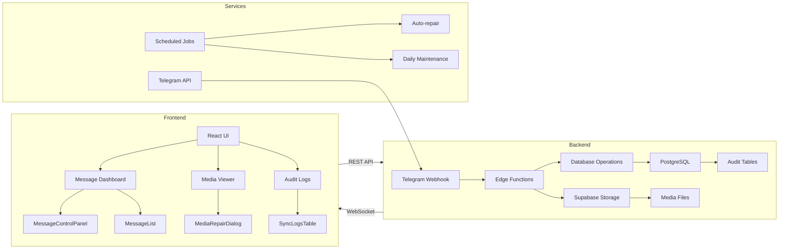
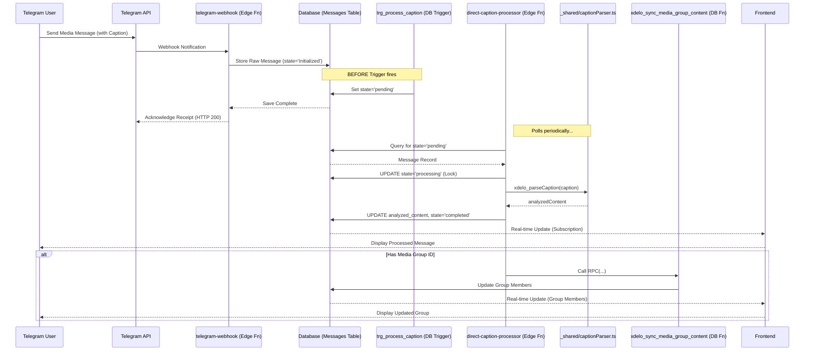
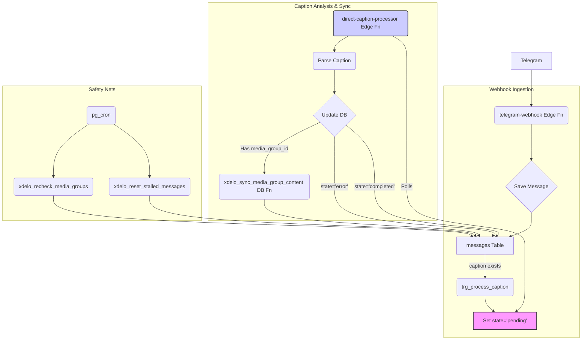
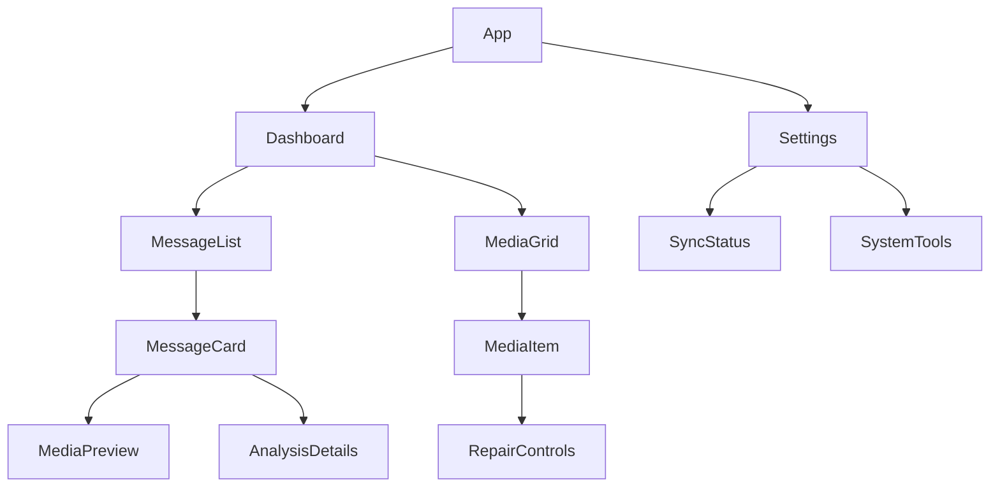
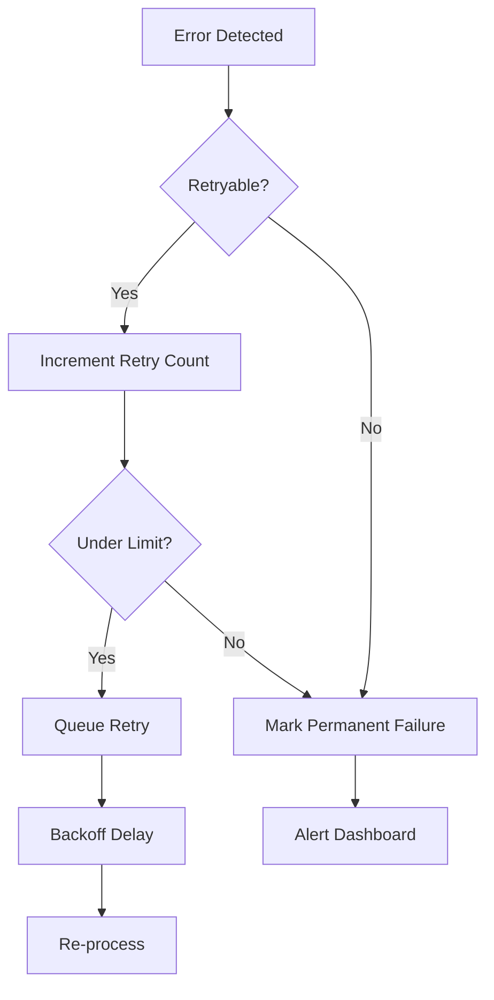
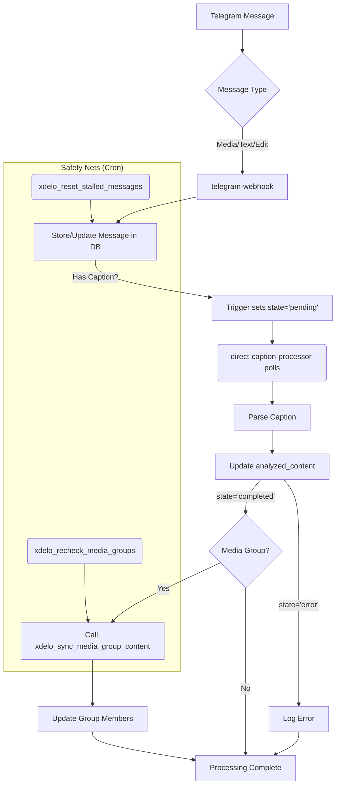

# xdelo-app - Telegram Message Processing System

## Knowledge Base

Telegram Webhook Entry Point (telegram-webhook/index.ts):

Receives webhook updates from Telegram
Generates a unique correlation ID for tracking
Determines message context (channel post, forwarded, edited)
Routes messages based on type:
Edited messages → handleEditedMessage
Media messages → handleMediaMessage
Other messages → handleOtherMessage
Media Message Handling (mediaMessageHandler.ts):

Duplicate Detection:

Checks for existing messages with same file_unique_id used for the name directly in the telegram-storage bucket
Updates existing record if found instead of creating new one
Media Group Handling:

Recognizes messages part of a media group
Maintains relationships between grouped messages
Syncs the analyzed content across group members (triggered by Edge Function)
Caption Processing:

DB Trigger (`trg_process_caption`) sets state to 'pending' for messages with captions.
Edge Function (`direct-caption-processor`) polls for 'pending' messages.
Edge Function uses shared parser (`_shared/captionParser.ts`).
Handles caption edits via the trigger re-setting state to 'pending'.
Processing States:

'initialized': Initial state for new messages.
'pending': Caption exists, ready for processing by `direct-caption-processor`. Set by DB trigger.
'processing': Actively being processed by `direct-caption-processor`.
'completed': Successfully processed, `analyzed_content` populated. Set by `direct-caption-processor` or sync function.
'error': Processing failed. Set by `direct-caption-processor`.
Media Group Synchronization:

Sync triggered by `direct-caption-processor` after successful caption processing via RPC call to `xdelo_sync_media_group_content`.
DB function `xdelo_sync_media_group_content` uses advisory locks.
Safety net cron job (`xdelo_recheck_media_groups`) ensures eventual consistency.
Maintains edit history and caption relationships.

detailed:
Caption Processing and Media Group Synchronization
1. Caption Processing Flow --> If No caption then will check for other media groups that are the same and see if they have analyzed content parsed from caption already completed and not null. It will sync if it  has captions then: 
A. Entry Points
Webhook (`telegram-webhook`) receives Telegram message.
Message stored in DB (`messages` table) with initial state 'initialized'.
DB Trigger (`trg_process_caption`) fires `BEFORE` save if caption exists, setting state to 'pending'.
Edge Function (`direct-caption-processor`) polls periodically for messages in 'pending' state.

B. Caption Analysis Algorithm (`_shared/captionParser.ts` called by `direct-caption-processor`)
The system uses a sophisticated multi-pattern matching approach:

Simple Patterns

- Single Quantity: "14x"
- Basic Product: "Gelato Cake"
- Product with Quantity: "Mochi x 1"
Complex Patterns

- Standard Format: "Product Name #CODE x Quantity"
- Special Format: "Platinum #2 #HEFF022425 x 1 (30 + behind)"
- Multiline Format: Multiple lines with product name, code, and notes
Data Extraction

Product Name: Text before code/quantity
Product Code: Text following '#' with specific format
Vendor UID: First 1-4 letters of product code
Purchase Date: 6 digits after vendor code (mmDDyy)
Quantity: Numbers following 'x' or preceding 'x'
Notes: Text in parentheses
C. Partial Success Handling
Missing Field Detection

Tracks which fields couldn't be parsed
Allows operation to continue with partial data
Marks message with partial_success flag
Metadata Tracking


{
  "parsing_metadata": {
    "method": "manual",
    "partial_success": true,
    "missing_fields": ["quantity", "purchase_date"],
    "quantity_pattern": "x 4",
    "timestamp": "2024-03-10T..."
  }
}

2. Media Group Synchronization
A. Synchronization (Triggered by Edge Function)
Trigger Points
`direct-caption-processor` successfully processes a message with a `media_group_id`.
Synchronization Process (Edge Function calls DB Function)


sequenceDiagram
    participant EF as direct-caption-processor
    participant DB as Database
    participant SYNC as xdelo_sync_media_group_content (DB Fn)
    participant G as Media Group Members
    
    EF->>DB: UPDATE analyzed_content, state='completed' (Source Msg)
    alt Source Message Processed Successfully & Has Media Group ID
      EF->>SYNC: Call RPC(source_msg_id, analyzed_content)
      SYNC->>DB: Acquire advisory lock (media_group_id)
      SYNC->>G: UPDATE analyzed_content, state='completed'
      SYNC->>DB: Release lock
      SYNC-->>EF: Return status
    end
B. Multi-Layer Fallback System (Safety Nets)
Primary Path

`direct-caption-processor` calls `xdelo_sync_media_group_content` (DB Function with advisory locks).
Fallback Mechanisms

Cron Job (`pg_cron`) -> `xdelo_recheck_media_groups` (DB Function) -> `xdelo_sync_incomplete_media_group` (DB Function) for eventual consistency.
Cron Job (`pg_cron`) -> `xdelo_reset_stalled_messages` (DB Function) for reprocessing stuck messages.
Manual Repair Tools (UI).
Error Recovery

Transaction rollback on failure
Automatic retry with backoff
Error logging and monitoring
Manual repair tools
C. State Management
Message States

initialized → processing → completed/error
Group Metadata


{
  "group_message_count": 4,
  "group_first_message_time": "2024-03-10T...",
  "group_last_message_time": "2024-03-10T...",
  "is_original_caption": true,
  "group_caption_synced": true
}
Edit History Tracking


{
  "edit_history": [
    {
      "timestamp": "2024-03-10T...",
      "type": "edit",
      "previous_analyzed_content": {...}
    }
  ]
}
3. Error Handling and Recovery
A. Transaction Management
Critical Sections

Caption analysis
Group synchronization
State updates
Rollback Scenarios

Parse failures
Sync conflicts
Network issues
B. Monitoring and Maintenance
Health Checks

Processing state counts
Stalled messages
Mixed group states
Automated Repairs

Reset stalled processes
Clear stuck locks
Repair group inconsistencies
C. Manual Intervention Tools
UI Controls

Force reprocessing
Group repair
State reset
Diagnostic Functions

Message status query
Group consistency check
Processing history view

### Full System Architecture


### Frontend Architecture

1. **Core Components**:
   - `MessageControlPanel`: Central hub for message operations
   - `MediaViewer`: Handles media display and repair workflows
   - `SyncLogsTable`: Real-time monitoring of sync operations

2. **State Management**:
   ```typescript
   // Example from useMessageQueue.ts
   const { messages, processingState, errorStats } = useMessageQueue({
     initialFilter: 'pending',
     refreshInterval: 15000,
     repairOptions: {
       autoRetry: true,
       maxAttempts: 3
     }
   });
   ```

3. **Key Flows**:
   - Media repair workflow with error recovery
   - Real-time message updates via Supabase subscriptions
   - Batch processing controls for large media groups

### End-to-End Workflow (Hybrid Plan)


### Key System Flows




### Key Features (Updated Context)

1.  **Media Processing**: (Handled by `telegram-webhook` & `media-management`)
    *   Automatic MIME type detection/correction
    *   Media download/upload to Supabase Storage.
2.  **Caption Analysis**: (Handled by `direct-caption-processor` & `_shared/captionParser.ts`)
    *   Pattern-based parsing via shared function.
    *   Vendor code normalization.
    *   Historical version tracking (`old_analyzed_content`).
3.  **Error Recovery**:
    *   Stalled message reset via `xdelo_reset_stalled_messages` (cron).
    *   Media group consistency check via `xdelo_recheck_media_groups` (cron).
    *   Cross-service correlation ID tracing (manual).

### Deployment Architecture]
    B --> C[Supabase PostgreSQL]
    B --> D[Supabase Storage]
    C --> E[OLAP Reporting]
    D --> F[CDN Distribution]
    G[Telegram] --> B
    H[React Frontend] --> B
    H --> C
    H --> D
```

### Frontend Component Hierarchy


### Error Recovery Workflow


### Project Overview
A robust system for processing Telegram messages with media attachments, designed to:
- Extract structured product data from media captions
- Maintain media group synchronization
- Provide comprehensive audit logging
- Handle message edits and updates gracefully

**Core Technologies:**
- Supabase (PostgreSQL + Storage)
- Deno Edge Functions
- Telegram Bot API
- React Frontend

### Key Features
1. **Media Processing Pipeline**
   - Automatic media download from Telegram
   - Storage in Supabase with public URL generation
   - MIME type validation and correction

2. **Caption Analysis Engine**
   - Pattern-based product data extraction
   - Vendor UID detection from product codes
   - Purchase date parsing from multiple formats

3. **Audit System**
   - Unified logging of all system operations
   - Message edit history tracking
   - Correlation ID tracing across services

4. **Error Recovery**
   - Automatic media redownloads
   - Stalled message detection/reset
   - Media group consistency checks

### Design Guidelines
1. **Architecture Principles**
   - Direct processing over queued systems
   - Transaction-based database operations
   - Edge-function first approach

2. **Error Handling**
   - Automatic retries with exponential backoff
   - Partial success states for complex operations
   - Daily maintenance jobs for system health

3. **Code Standards**
   - TypeScript across all layers
   - SQL functions for complex data operations
   - React hooks for frontend state management

---

## Overview

This system processes Telegram messages with media and captions, extracting structured data while maintaining media group synchronization and audit logging. The system focuses on reliability and maintainability with direct processing instead of queues.



## Key Components (Hybrid Plan)

### 1. Telegram Webhook Handler (`telegram-webhook`)
- Entry point for all Telegram updates.
- Stores message data via `createMessage`.
- **Does not** trigger analysis directly.

### 2. Database Trigger (`trg_process_caption`)
- Runs `BEFORE INSERT/UPDATE` on `messages` table.
- Executes `xdelo_set_caption_pending_trigger` **only if** `caption` is present.
- Sets `processing_state` to `'pending'`.

### 3. Caption Analysis Engine (`direct-caption-processor` Edge Fn + `_shared/captionParser.ts`)
- Edge function polls for `'pending'` messages.
- Locks message by setting state to `'processing'`.
- Calls shared `xdelo_parseCaption` function.
- Updates `analyzed_content` and sets state to `'completed'` or `'error'`.

### 4. Media Group Synchronization (`direct-caption-processor` + `xdelo_sync_media_group_content` DB Fn)
- After successful processing, `direct-caption-processor` calls `xdelo_sync_media_group_content` RPC if message is in a group.
- DB function uses advisory locks and updates group members.

### 5. Unified Audit Logging
```sql
-- From simplified-audit-logging.md
CREATE TABLE unified_audit_logs (
  id UUID PRIMARY KEY,
  event_type VARCHAR(50) NOT NULL,
  entity_id UUID NOT NULL,
  previous_state JSONB,
  new_state JSONB,
  metadata JSONB,
  correlation_id TEXT,
  event_timestamp TIMESTAMPTZ DEFAULT NOW()
);
```

## Processing States

| State | Description | Next Actions |
|-------|-------------|--------------|
| State | Description | Set By | Next Actions |
|-------|-------------|--------|--------------|
| `initialized` | Initial state after message receipt | `telegram-webhook` | Wait for trigger or ignore |
| `pending` | Caption exists, ready for processing | `trg_process_caption` | Polled by `direct-caption-processor` |
| `processing` | Analysis in progress | `direct-caption-processor` | Completion or error |
| `completed` | Successful processing | `direct-caption-processor` / `xdelo_sync_media_group_content` | - |
| `error` | Failed processing | Automatic retries |

## Error Handling

### Retry Mechanism
```typescript
// From analysisHandler.ts
async function handleAnalysisError(messageId: string, error: Error) {
  await supabase
    .from('messages')
    .update({
      retry_count: supabase.sql`COALESCE(retry_count, 0) + 1`,
      last_error_at: new Date().toISOString()
    })
    .eq('id', messageId);

  if (retryCount < MAX_RETRIES) {
    await supabase
      .from('messages')
      .update({ processing_state: 'pending' })
      .eq('id', messageId);
  }
}
```

### Recovery Tools (Safety Nets)
1. `xdelo_redownload_missing_media` - Recover failed media (Assumed separate process).
2. `xdelo_reset_stalled_messages` (DB Fn / Cron) - Resets messages stuck in 'processing'.
3. `xdelo_recheck_media_groups` (DB Fn / Cron) - Fixes group inconsistencies (replaces `xdelo_repair_media_group_syncs`).

## Deployment

### Environment Setup
```toml
# supabase/config.toml
[telegram]
bot_token = "YOUR_BOT_TOKEN"
api_id = "YOUR_API_ID"
api_hash = "YOUR_API_HASH"

[storage]
bucket_name = "telegram-media"
max_file_size = "20MB"
```

### Required Services
1. Supabase PostgreSQL
2. Supabase Storage
3. Telegram Bot API
4. Deno Edge Functions

## Documentation Structure

```
docs/
├── consolidated-functions.md      # Core database functions
├── direct-caption-processing.md   # Caption analysis details
└── simplified-audit-logging.md    # Audit system design
```

## Monitoring

Key metrics tracked:
1. Messages processed/minute
2. Error rate by category
3. Media group sync success rate
4. Average processing latency

```sql
-- From v_message_audit_trail
SELECT * FROM v_message_audit_trail
WHERE entity_id = 'message-uuid'
ORDER BY event_timestamp DESC;
```

## Maintenance

Scheduled jobs (`pg_cron`):
```sql
-- Example Cron Job Setup (Illustrative - Actual scheduling via DB commands)
-- SELECT cron.schedule('reset-stalled', '*/15 * * * *', 'SELECT xdelo_reset_stalled_messages(15)');
-- SELECT cron.schedule('recheck-groups', '*/1 * * * *', 'SELECT xdelo_recheck_media_groups()');
```
- **Stalled Message Reset:** Runs `xdelo_reset_stalled_messages` periodically (e.g., every 15 mins).
- **Group Consistency Check:** Runs `xdelo_recheck_media_groups` periodically (e.g., every 1 min).
- Other maintenance jobs (e.g., `xdelo_daily_maintenance`) assumed separate.
