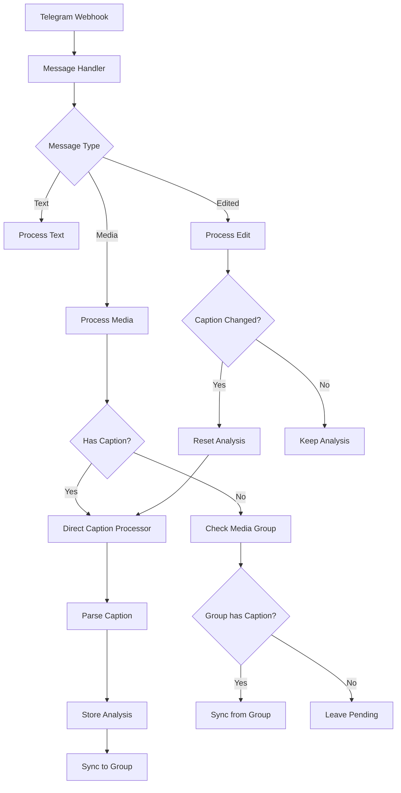
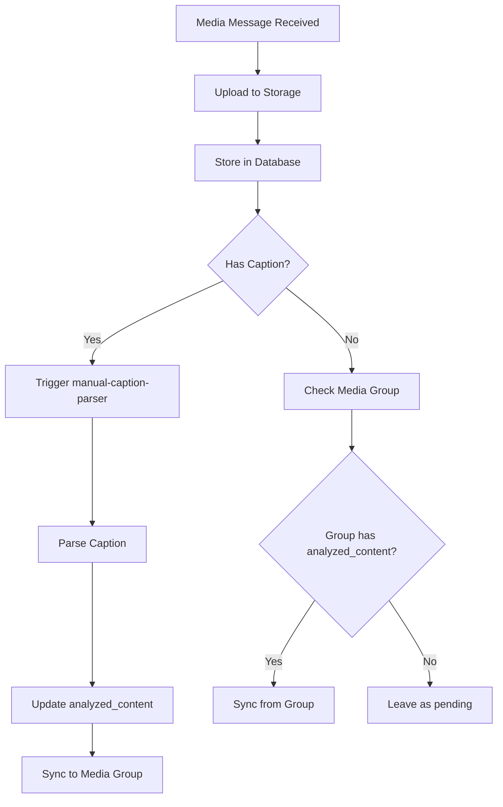
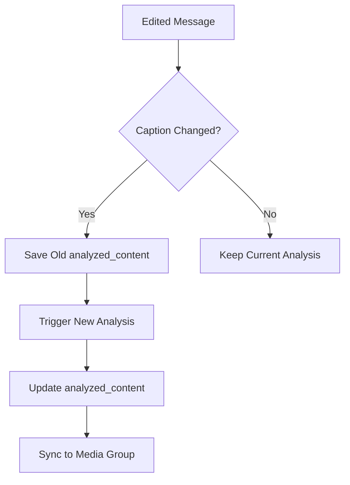

# Telegram Webhook Flow

## Overview

This document describes the complete system architecture for processing Telegram messages, focusing on the integration between Edge Functions, database functions, and triggers. The system processes media messages with captions, analyzes content, and maintains media group synchronization.



## System Architecture

### 1. Edge Functions

The system uses three primary edge functions:

| Function | Purpose | Processing Time | Status |
|----------|---------|-----------------|--------|
| `telegram-webhook` | Entry point for all Telegram updates | 300-500ms | Active |
| `manual-caption-parser` | Parses captions from messages | 200-600ms | Active (with occasional 500 errors) |
| `log-operation` | Logs operational events | 60-100ms | Active |
| `xdelo_sync_media_group` | Synchronizes media group content | 150-300ms | Active |

#### Edge Function Flow:

1. **telegram-webhook**: 
   - Receives updates from Telegram
   - Identifies message type (media, text, edited)
   - Processes media files (uploads to storage)
   - Routes to appropriate handlers
   - Average processing time: ~300-500ms

2. **manual-caption-parser**:
   - Triggered by database insert/update on messages with captions
   - Parses caption using pattern matching
   - Updates message with analyzed content
   - Synchronizes content to media groups
   - Average processing time: ~200-600ms

3. **xdelo_sync_media_group**:
   - Synchronizes analyzed content across media groups
   - Uses advisory locks to prevent race conditions
   - Called by other edge functions or database triggers
   - Average processing time: ~150-300ms

### 2. Database Functions

The system relies on several database functions for processing and maintenance:

| Function | Purpose | Trigger |
|----------|---------|---------|
| `xdelo_parse_caption` | Pattern-based caption parsing | Manual call |
| `xdelo_process_message_with_caption` | Process a message with caption | Database trigger |
| `xdelo_check_media_group_content` | Check and sync media group content | Called by other functions |
| `xdelo_process_pending_messages` | Batch process pending messages | Scheduled job |
| `xdelo_reset_stalled_messages` | Reset messages stuck in processing | Scheduled job |
| `xdelo_sync_media_group_content` | Synchronize media group content | Called by other functions |
| `xdelo_find_caption_message` | Find authoritative caption in group | Called by other functions |

#### Database Function Flow:

1. **Caption Processing**:
   ```
   xdelo_process_message_with_caption
   ├── xdelo_parse_caption (extract structured data)
   └── xdelo_check_media_group_content (sync to group)
   ```

2. **Media Group Handling**:
   ```
   xdelo_sync_media_group_content
   ├── xdelo_find_caption_message (locate authoritative source)
   └── Database update (sync content to all messages)
   ```

3. **Maintenance**:
   ```
   xdelo_process_pending_messages (run every 5 minutes)
   xdelo_reset_stalled_messages (run daily)
   ```

### 3. Database Triggers

The system uses triggers to automate processing:

| Trigger | Table | Event | Action |
|---------|-------|-------|--------|
| `manual-caption-parser` | `messages` | `INSERT/UPDATE` on caption | Parse caption with edge function |
| `xdelo_trg_handle_forward` | `messages` | `INSERT` with forward data | Process forwarded messages |
| `xdelo_trg_extract_analyzed_content` | `messages` | `UPDATE` on analyzed_content | Extract structured data |
| `xdelo_media_group_history_sync` | `messages` | `UPDATE` on edit_history | Sync history across group |

## Message Processing Flow

### 1. Entry Point: Telegram Webhook

- Receives webhook requests from Telegram
- Identifies message type (media, text, edited, forwarded)
- Routes to appropriate handlers
- Generates a unique correlation ID for tracking

### 2. Media Message Processing



1. **Media Extraction**:
   - Downloads media from Telegram
   - Uploads to 'telegram-media' storage bucket
   - Generates public URL
   - Stores metadata in 'messages' table

2. **Caption Processing**:
   - Triggered by database insert/update
   - `manual-caption-parser` edge function processes caption
   - Pattern matching extracts:
     - product_name: Text before '#', line break, dash, or 'x'
     - product_code: Text following '#' symbol
     - vendor_uid: First 1-4 letters of product_code (uppercase)
     - purchase_date: Parse date portion from product_code
     - quantity: Number following 'x' or similar quantity indicators
     - notes: Text in parentheses or remaining unclassified text
   - Fallback to database function if edge function fails

3. **Media Group Synchronization**:
   - First message with caption becomes authoritative
   - `xdelo_sync_media_group` synchronizes content to all messages
   - Advisory locks prevent concurrent updates
   - Full audit logging of all operations

### 3. Edited Message Processing



- Tracks edit history in edit_history array
- Preserves previous analyzed_content in old_analyzed_content
- Resets analysis if caption changes
- Ensures edit history consistency across media groups

### 4. Processing States

Messages progress through multiple states:

1. `initialized`: Initial state after message reception
2. `pending`: Waiting for processing
3. `processing`: Currently being processed
4. `completed`: Successfully processed
5. `error`: Failed processing
6. `partial_success`: Some fields successfully parsed

## Error Handling and Recovery

The system includes robust error handling:

1. **Automatic Retry**:
   - Failed analyses are automatically retried
   - Incremental backoff for repeated failures
   - Transaction rollback on critical errors

2. **Manual Recovery**:
   - `xdelo_repair_media_group_syncs()`: Repairs broken media group synchronizations
   - `xdelo_reset_stalled_messages()`: Resets messages stuck in processing
   - `repair-processing-flow`: Edge function for system-wide repairs

3. **Maintenance Functions**:
   - Scheduled cleanup of stalled processes
   - Automatic reset of stuck messages
   - Daily maintenance of processing states

## Performance Optimizations

Recent improvements to the system include:

1. **Transaction-Based Processing**:
   - Database transactions ensure data consistency
   - Advisory locks prevent race conditions
   - Atomic operations for critical updates

2. **Direct Processing Model**:
   - Replacement of queue system with direct processing
   - Database triggers initiate processing
   - Reduced latency and complexity

3. **Parallel Processing**:
   - Independent messages processed in parallel
   - Media group synchronization protected by locks
   - Batch processing for efficiency

## Monitoring and Logging

The system includes comprehensive monitoring:

1. **Unified Audit Logs**:
   - All operations logged in `unified_audit_logs` table
   - Correlation IDs for end-to-end tracking
   - Structured metadata for analysis

2. **Health Metrics**:
   - Processing state counts
   - Error rate monitoring
   - Processing time tracking

3. **Alert System**:
   - Automatic detection of processing issues
   - Notification of stalled messages
   - Error rate threshold alerts

## Integration Points

The system integrates with:

1. **Telegram Bot API**:
   - Webhook for message reception
   - Media file downloading
   - Message editing and deletion

2. **Storage System**:
   - 'telegram-media' bucket for media files
   - Public URLs for frontend access
   - Automatic cleanup on deletion

3. **Frontend Application**:
   - Real-time message display
   - Media group visualization
   - Processing state indicators

## Configuration and Deployment

The system uses:

1. **Environment Variables**:
   - `SUPABASE_URL`: Supabase project URL
   - `SUPABASE_SERVICE_ROLE_KEY`: Service role key
   - Other Telegram-specific credentials

2. **Scheduled Jobs**:
   - `process-pending-messages`: Every 5 minutes
   - `xdelo-daily-maintenance`: Daily at 3 AM

3. **Deployment Process**:
   - Edge functions deployed via Supabase CLI
   - Database migrations for schema changes
   - Scheduled job configuration via SQL

## Security and Authentication

The system implements a flexible JWT verification model:

1. **Security Levels**:
   - `PUBLIC`: No JWT verification required
   - `AUTHENTICATED`: Requires a valid user JWT
   - `SERVICE_ROLE`: Requires a service role JWT

2. **JWT Verification Options**:
   - `fallbackToPublic`: Optional fallback to public access when JWT verification fails
   - `bypassForServiceRole`: Allows service role tokens to bypass regular security checks

3. **Implementation**:
   - Shared JWT verification utility across all edge functions
   - Integration with error handling middleware
   - Configuration via function's `config.toml` and code-level options

4. **Usage**:
   ```typescript
   // Example of using the secure handler with AUTHENTICATED level:
   serve(withErrorHandling(
     'function-name', 
     handlerFunction, 
     { 
       securityLevel: SecurityLevel.AUTHENTICATED,
       fallbackToPublic: false
     }
   ));
   ```

5. **Function Configuration**:
   - Function-specific security in `config.toml` using `verify_jwt` flag
   - Granular control over which functions require authentication

## Recent Improvements

Recent system enhancements include:

1. **Reliability Improvements**:
   - Replacement of queue-based system with direct processing
   - Transaction-based operations for data consistency
   - Improved error handling and recovery

2. **Performance Optimizations**:
   - Enhanced caption parsing with multiple strategies
   - Optimized database indexes for faster queries
   - Reduced latency in media group synchronization

3. **Security Enhancements**:
   - Flexible JWT authentication system
   - Multiple security levels with fallback options
   - Comprehensive error logging
   - Access control based on token roles

4. **Maintenance Features**:
   - Automated health checks
   - Self-healing capabilities
   - Comprehensive audit logging
