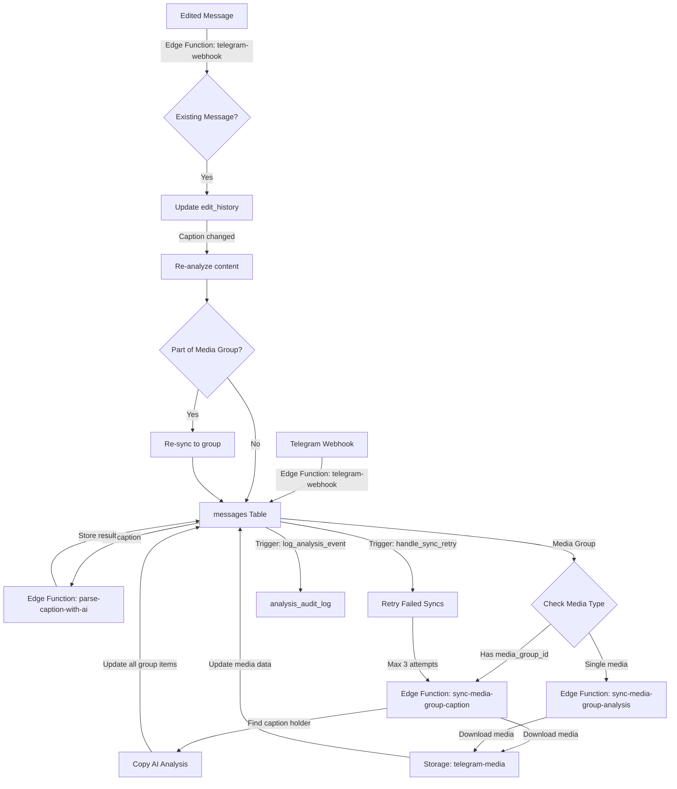

# Sync Harmony: Telegram Media Collection & Product Management System

## System Flow Overview

## Core Components

### Edge Functions

1. `telegram-webhook`
   - Validates and processes incoming Telegram updates
   - Handles message deduplication
   - Stores messages with proper JSONB handling
   - Tracks edit history for message changes
   - Handles edited messages and channel posts

2. `parse-caption-with-ai`
   - Uses OpenAI for caption analysis
   - Extracts product details (name, quantity, vendor)
   - Handles confidence scoring

3. `sync-media-group-caption`
   - Manages media group synchronization
   - Propagates analysis across group members
   - Handles retry mechanisms

### Database Structure

1. `messages` Table
   - Stores message data and analysis results
   - Handles media groups and caption relationships
   - Tracks processing state and retry attempts
   - Maintains edit history for message changes
   - Stores channel post edits

2. `analysis_audit_log` Table
   - Tracks analysis events and changes
   - Stores processing metadata
   - Enables debugging and monitoring

### Key Features

1. Media Processing
   - Automatic media download and storage
   - Thumbnail generation
   - Group synchronization
   - Retry mechanism for failed operations

2. Content Analysis
   - AI-powered caption parsing
   - Confidence scoring
   - Vendor and product identification
   - Quantity extraction

3. User Interface
   - Responsive product gallery
   - Advanced filtering capabilities
   - Media group navigation
   - Mobile-optimized layout

4. Edit History Tracking
   - Complete history of message edits
   - Timestamp tracking for all changes
   - Channel post edit handling
   - Automatic re-analysis of edited content

### Error Handling

- Automatic retry for failed syncs (max 3 attempts)
- Detailed error logging
- Processing state tracking
- Group-level synchronization recovery

### Monitoring

- Analysis audit logging
- Processing state tracking
- Media group sync status
- Error rate monitoring
- Edit history tracking

## Database Optimizations

- Indexes for frequently queried fields
- GIN index for JSONB fields (edit_history, analyzed_content)
- Partial indexes for edited messages
- Database triggers for automatic edit history updates

For detailed technical documentation and API references, please refer to the respective component directories.
