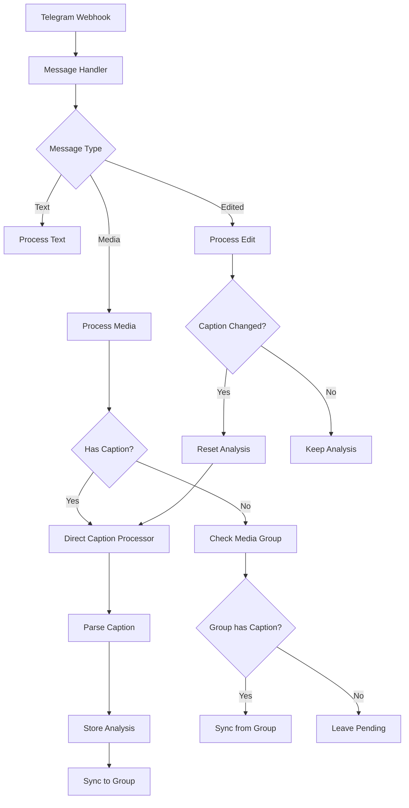

# Telegram Webhook Flow

## Overview

This document describes the flow of data through the Telegram webhook system, focusing on how messages with media are processed, especially for forwarded channel posts and edited messages.

## Message Processing Flow

### 1. Entry Point: Telegram Webhook

- Receives webhook requests from Telegram
- Identifies message type (media, text, edited, forwarded)
- Routes to appropriate handlers
- Generates a unique correlation ID for tracking the message through the system

### 2. Message Handlers

#### Media Message Handler

Processes messages containing photos, videos or documents:

1. **Media Extraction**:
   - Downloads media from Telegram
   - Uploads to Supabase storage
   - Generates public URLs for access
   - Handles different file types including photos, videos, and documents

2. **Direct Caption Processing**:
   - If caption exists, triggers immediate processing
   - No queueing system is used; processing happens in real-time
   - Uses database transactions to ensure consistency
   - Maintains correlation ID throughout the process

3. **Media Group Handling**:
   - For media groups, first message with caption becomes authoritative
   - Advisory locks prevent concurrent media group updates
   - Analyzed content is synchronized to all messages in the group
   - Messages without captions inherit analysis from the group

#### Edited Message Handler

Handles edited messages from Telegram:

1. **Edit Tracking**:
   - Tracks edit history in edit_history array
   - Preserves previous analyzed_content in old_analyzed_content
   - Maintains chronological order of edits

2. **Caption Changes**:
   - If caption changes, resets analyzed_content
   - Triggers direct re-analysis of caption
   - For media groups, resets analysis of entire group
   - Ensures edit history consistency across media groups

#### Forward Message Handler

Processes forwarded messages:

1. **Forward Detection**:
   - Identifies forwards by matching file_unique_id
   - Tracks original message reference
   - Maintains forward count and chain

2. **Content Handling**:
   - Preserves original analyzed content in history
   - Re-analyzes caption for contextual changes
   - Links back to original message for tracking

#### Text Message Handler

Processes text-only messages, commands, and other non-media content.

### 3. Message Processing States

Messages go through multiple processing states:

1. `initialized`: Initial state after message is received
2. `pending`: Waiting for processing
3. `processing`: Currently being processed
4. `completed`: Successfully processed
5. `error`: Failed processing

### 4. Direct Caption Processing

The direct caption processor replaces the previous queue system:

1. **Trigger**: 
   - New message with caption
   - Updated message with changed caption
   - Database trigger on message insert/update

2. **Transaction Model**:
   - Uses database transactions to ensure data consistency
   - Locks relevant rows during processing
   - Maintains correlation ID through entire process

3. **Processing Steps**:
   - Manual parsing for standard patterns
   - Pattern-based parsing with multiple strategies
   - Media group synchronization
   - Complete audit logging

### 5. Media Group Synchronization

Enhanced media group handling with transaction support:

1. **Synchronization Strategy**:
   - Advisory locks prevent concurrent updates
   - First message with caption becomes authoritative
   - Consistent edit history across all group messages
   - Forward tracking preserved across group

2. **Coordination Functions**:
   - `xdelo_sync_media_group_content`: Syncs content to all group messages
   - `xdelo_find_caption_message`: Locates authoritative caption in group
   - `xdelo_check_media_group_content`: Checks and applies group content
   - Transaction-based approach ensures consistency

### 6. Transaction Management

Transaction-based processing ensures consistency:

1. **Transaction Functions**:
   - `xdelo_begin_transaction`: Initializes transaction with unique ID
   - `xdelo_commit_transaction_with_sync`: Commits with group synchronization
   - `xdelo_update_message_with_analyzed_content`: Atomic message updates
   - `xdelo_handle_failed_caption_analysis`: Consistent error handling

2. **Advisory Locks**:
   - Prevent race conditions on media group updates
   - Ensure only one process updates a group at a time
   - Allow parallel processing of unrelated groups

### 7. Error Handling and Recovery

Improved error handling with transaction support:

1. **Automatic Retry**:
   - Failed analyses are automatically retried
   - Incremental backoff for repeated failures
   - Transaction rollback on critical errors

2. **Manual Recovery**:
   - `xdelo_repair_media_group_syncs()`: Repairs broken media group synchronizations
   - `xdelo_reset_stalled_messages()`: Resets messages stuck in processing
   - `repair-processing-flow`: Edge function for system-wide repairs

3. **Maintenance Functions**:
   - Scheduled cleanup of stalled processes
   - Automatic reset of stuck messages
   - Daily maintenance of processing states

### 8. Audit Logging

Comprehensive audit logging for all operations:

1. **Log Types**:
   - Message state changes
   - Processing events
   - Media group synchronizations
   - Transaction events
   - Error conditions

2. **Correlation Tracking**:
   - Each message flow has a unique correlation ID
   - All related operations share the same ID
   - Enables full tracing of message processing

3. **Log Storage**:
   - Centralized `unified_audit_logs` table
   - Structured metadata in JSONB format
   - Retention policies for log management

### 9. Edge Functions

Key edge functions in the processing flow:

1. **Processing Functions**:
   - `direct-caption-processor`: Processes captions in real-time
   - `parse-caption-with-ai`: Parses captions using pattern matching
   - `manual-caption-parser`: Low-level caption parsing

2. **Maintenance Functions**:
   - `repair-processing-flow`: Repairs processing system issues
   - `scheduler-process-queue`: Processes pending messages
   - `xdelo_sync_media_group`: Synchronizes media groups

3. **Utility Functions**:
   - `redownload-from-media-group`: Recovers media files
   - `validate-storage-files`: Validates storage integrity
   - `repair-storage-paths`: Repairs invalid storage paths

### 10. Database Triggers

Key database triggers in the system:

1. **Message Triggers**:
   - `trigger_direct_caption_analysis`: Triggers direct caption processing
   - `xdelo_trg_handle_forward`: Handles forwarded messages
   - `xdelo_trg_extract_analyzed_content`: Extracts structured content
   - `xdelo_media_group_history_sync`: Synchronizes media group history

2. **Maintenance Triggers**:
   - `trigger_retry_failed_analysis`: Retries failed analyses
   - `trg_check_media_group_on_message_change`: Checks media group content
   - `trg_ensure_edit_history_consistency`: Ensures consistent edits
