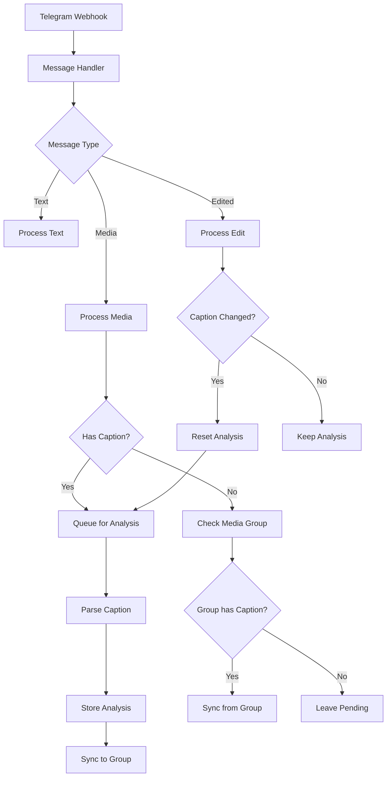

# Telegram Webhook Flow

## Overview

This document describes the flow of data through the Telegram webhook system, focusing on how messages with media are processed, especially for forwarded channel posts and edited messages.

## Message Processing Flow

### 1. Entry Point: Telegram Webhook

- Receives webhook requests from Telegram
- Identifies message type (media, text, edited, forwarded)
- Routes to appropriate handlers

### 2. Message Handlers

#### Media Message Handler

Processes messages containing photos, videos or documents:

1. **Media Extraction**:
   - Downloads media from Telegram
   - Uploads to Supabase storage
   - Generates public URLs for access

2. **Caption Analysis**:
   - If caption exists, queues for processing
   - Caption processing is two-stage:
      - Manual parsing for standard patterns
      - AI analysis for complex descriptions

3. **Media Group Handling**:
   - For media groups, first message with caption becomes authoritative
   - Analyzed content is synchronized to all messages in the group
   - Messages without captions inherit analysis from the group

#### Edited Message Handler

Handles edited messages from Telegram:

1. **Edit Tracking**:
   - Tracks edit history in edit_history field
   - Preserves previous analyzed_content in old_analyzed_content

2. **Caption Changes**:
   - If caption changes, resets analyzed_content
   - Triggers re-analysis of caption
   - For media groups, resets analysis of entire group

#### Text Message Handler

Processes text-only messages, commands, and other non-media content.

### 3. Database Functions

#### Content Analysis

- `xdelo_analyze_message_caption`: Prepares message for analysis
- `xdelo_queue_message_for_processing`: Queues messages for processing
- `xdelo_complete_message_processing`: Finalizes processing results

#### Media Group Synchronization

- `xdelo_sync_media_group_content`: Syncs analyzed content to all messages in a group
- `xdelo_find_caption_message`: Locates the source caption in a media group
- `xdelo_check_media_group_content`: Checks and applies media group content

#### Message State Management

- `xdelo_handle_message_update`: Handles message updates
- `xdelo_handle_message_forward`: Processes forwarded messages
- `xdelo_extract_analyzed_content`: Extracts structured data

### 4. Edge Functions

#### Analysis Pipeline

- `parse-caption-with-ai`: Analyzes captions using manual and AI methods
- `analyze-with-ai`: Performs AI analysis on complex captions
- `process-message-queue`: Processes the analysis queue

#### Media Management

- `redownload-from-media-group`: Recovers media files from media groups
- `validate-storage-files`: Validates storage integrity
- `repair-storage-paths`: Repairs invalid storage paths

#### Admin and Maintenance

- `process-unanalyzed-messages`: Retroactively processes messages
- `xdelo_sync_media_group`: Syncs media groups on demand
- `update-telegram-caption`: Updates captions in Telegram

### 5. Database Triggers

- `xdelo_trg_message_update`: Handles message updates
- `xdelo_trg_extract_analyzed_content`: Extracts analyzed content
- `xdelo_auto_queue_messages_trigger`: Auto-queues messages for processing
- `xdelo_trg_check_media_group`: Checks media group content
- `xdelo_media_group_history_sync`: Syncs media group history

## Message States

Messages go through multiple processing states:

1. `initialized`: Initial state after message is received
2. `pending`: Waiting for processing
3. `processing`: Currently being processed
4. `completed`: Successfully processed
5. `error`: Failed processing

## Database Structure

### Key Tables

- `messages`: Stores all media messages
- `other_messages`: Stores text-only messages
- `message_processing_queue`: Manages processing queue
- `unified_audit_logs`: Centralized audit logging
- `deleted_messages`: Archive of deleted messages

### Key Columns

For `messages` table:
- `analyzed_content`: JSON object with structured data
- `old_analyzed_content`: Array of previous analyzed content
- `processing_state`: Current processing state
- `media_group_id`: Telegram media group ID
- `is_original_caption`: Flag for caption authority
- `group_caption_synced`: Flag for group sync status

## Error Handling and Recovery

### Automatic Retry

- Failed analyses are retried up to 3 times
- Processing errors are logged with detailed diagnostics
- Queue system ensures no message is lost

### Manual Recovery

- `xdelo_repair_media_group_syncs()`: Repairs broken media group synchronizations
- `xdelo_repair_storage_paths()`: Fixes storage path issues
- `xdelo_diagnose_queue_issues()`: Diagnoses queue problems

## Audit Logging

All operations are logged in the `unified_audit_logs` table:

- Message creation, updates, and deletions
- Processing state changes
- Media group synchronizations
- Media downloads and storage operations

## Recent Improvements

### Media Group Handling

- Improved synchronization with proper locking
- Better handling of missing captions
- More robust conflict resolution

### Caption Analysis

- Two-stage parsing: Manual + AI analysis
- Better handling of complex product descriptions
- Improved extraction of quantities and dates

### Message Editing

- Proper history tracking for all edits
- Preservation of previous analyses
- Consistent group synchronization
