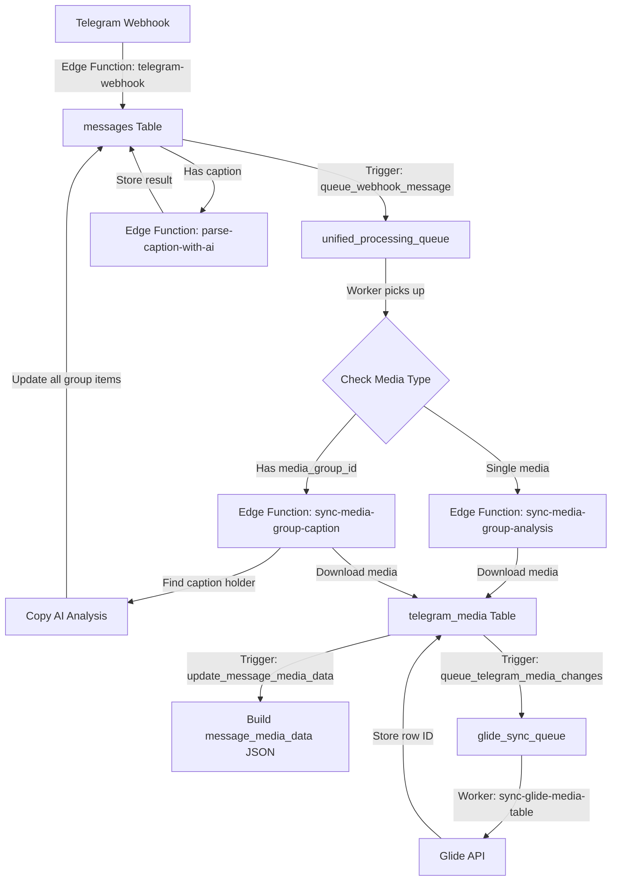

# Sync Harmony: Telegram Media Collection & Product Management System

## System Flow Overview



## Core Components

### Edge Functions

1. `telegram-webhook/`

   - Entry point for all Telegram updates
   - Validates webhook authenticity
   - Stores messages in `messages` table
   - Triggers initial AI analysis if caption exists

2. `parse-caption-with-ai/`

   - Analyzes message captions using AI
   - Extracts product information
   - Updates `analyzed_content` in messages table

3. `sync-media-group-caption/`

   - Handles media group synchronization
   - Identifies caption holder in groups
   - Propagates AI analysis across group

4. `sync-media-group-analysis/`
   - Processes single media items
   - Downloads media files
   - Updates telegram_media table

### Database Triggers

1. `queue_webhook_message`

   - **Table**: messages
   - **Event**: AFTER INSERT
   - **Action**: Inserts into unified_processing_queue
   - **Queue Type**: 'webhook'

2. `update_message_media_data`

   - **Table**: telegram_media
   - **Event**: BEFORE INSERT OR UPDATE
   - **Action**: Builds consolidated message_media_data JSON

3. `queue_telegram_media_changes`
   - **Table**: telegram_media
   - **Event**: AFTER INSERT OR UPDATE
   - **Action**: Queues changes for Glide sync

### Database Functions

1. `fn_queue_webhook_message()`

   - Handles webhook message queueing
   - Sets priority and retry parameters

2. `fn_update_message_media_data()`

   - Builds consolidated JSON for media records
   - Includes message, analysis, meta, and thumbnail data

3. `fn_queue_glide_sync()`
   - Manages Glide synchronization queue
   - Handles retry logic and error states

### Processing Queues

1. `unified_processing_queue`

   - Central queue for all processing tasks
   - Handles webhook and media processing
   - Manages retries and error states

2. `glide_sync_queue`
   - Dedicated queue for Glide synchronization
   - Tracks sync status and failures
   - Manages bidirectional updates

## Data Flow Steps

1. **Message Reception**

   - Telegram webhook received
   - Message stored in `messages` table
   - Initial AI analysis if caption exists

2. **Queue Processing**

   - Message queued in `unified_processing_queue`
   - Worker picks up based on queue type
   - Routes to appropriate processing function

3. **Media Group Handling**

   - Groups identified by `media_group_id`
   - Caption holder identified
   - AI analysis propagated to all group items

4. **Media Processing**

   - Media files downloaded
   - Thumbnails generated
   - Stored in Supabase storage
   - Records created in `telegram_media` table

5. **Glide Synchronization**
   - Changes queued for Glide sync
   - Data mapped to Glide schema
   - Row IDs stored after successful sync
   - URLs generated for Glide app access

## Error Handling

- Failed operations logged with detailed error messages
- Retry mechanism for transient failures
- Maximum retry attempts configurable
- Error escalation for persistent failures

## Database Schema

### messages Table

```sql
CREATE TABLE public.messages (
    id bigint PRIMARY KEY,
    message_id bigint NOT NULL,
    chat_id bigint NOT NULL,
    media_group_id text,
    caption text,
    message_data jsonb NOT NULL,
    sender_info jsonb,
    message_type text NOT NULL,
    analyzed_content jsonb DEFAULT '{}'::jsonb,
    message_url text,
    status text DEFAULT 'pending',
    created_at timestamptz DEFAULT now(),
    updated_at timestamptz DEFAULT now()
);
```

### telegram_media Table

```sql
CREATE TABLE public.telegram_media (
    id bigint PRIMARY KEY,
    message_id bigint REFERENCES public.messages(id),
    file_id text NOT NULL,
    file_unique_id text NOT NULL,
    file_type text NOT NULL,
    public_url text,
    thumbnail_url text,
    analyzed_content jsonb,
    caption text,
    telegram_data jsonb,
    message_url text,
    media_group_id text,
    telegram_media_row_id text,
    glide_app_url text,
    thumbnail_state text,
    message_media_data jsonb,
    created_at timestamptz DEFAULT now(),
    updated_at timestamptz DEFAULT now()
);
```

## Configuration

Environment variables and configurations are managed through `config.toml` files in each function directory. Key configurations include:

- Telegram Bot Token
- OpenAI API Key
- Glide API Credentials
- Database Connection Settings

## Development Guidelines

- Follow TypeScript best practices
- Use provided naming conventions
- Implement comprehensive error handling
- Document all major changes
- Test thoroughly before deployment

## Deployment

Functions are deployed to Supabase Edge Functions. Database migrations are managed through Supabase CLI.

## Monitoring

- Monitor queue lengths and processing times
- Track error rates and types
- Watch for failed synchronizations
- Monitor storage usage and API limits
