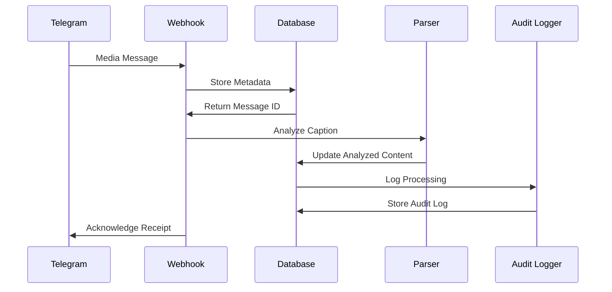
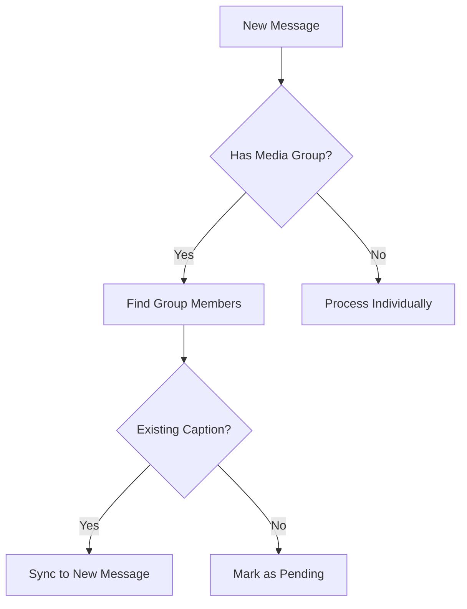

# Direct Caption Processing

This document outlines the simplified message caption processing flow that eliminates external dependencies and HTTP calls.

## Overview

The new message processing architecture uses PostgreSQL functions to directly analyze captions, improving reliability and performance by:

1. Eliminating external dependencies (Make.com, n8n)
2. Removing unnecessary edge function calls
3. Ensuring consistent handling of correlation IDs
4. Simplifying the media group synchronization process

## Processing Flow

### 1. Message Creation/Update

When a message is created or updated with a caption:

```
Telegram → telegram-webhook → messages table → xdelo_process_caption_workflow
```

The `trg_process_caption` trigger fires on any message with a caption that has `processing_state = 'pending'` or `processing_state = 'initialized'`.

### 2. Caption Analysis

Messages are processed by the `xdelo_process_caption_workflow` function, which:

1. Validates the message exists and has a caption
2. Calls `xdelo_direct_caption_processing` to parse the caption
3. Updates the message with analyzed content
4. Handles media group synchronization if needed

### 3. Media Group Synchronization

For messages that are part of a media group:

1. Analyzed content is automatically synchronized to all messages in the group
2. A single message acts as the "source of truth" for the entire group
3. The `xdelo_sync_media_group_content` function handles synchronization

## Database Functions

Key database functions:

- `xdelo_process_caption_workflow`: Entry point for caption processing
- `xdelo_direct_caption_processing`: Processes captions with rule-based parsing
- `xdelo_parse_caption`: Rule-based parser that extracts structured data
- `xdelo_sync_media_group_content`: Syncs analyzed content across media groups

## Frontend Integration

Frontend components use direct database RPC calls instead of edge functions:

```typescript
// Example: Reanalyzing a message caption
const { data, error } = await supabase.rpc(
  'xdelo_process_caption_workflow',
  {
    p_message_id: message.id,
    p_correlation_id: correlationId,
    p_force: true
  }
);
```

## Benefits

1. **Reliability**: No dependency on external services
2. **Performance**: Lower latency by eliminating HTTP calls
3. **Simplicity**: Fewer moving parts and clear responsibility boundaries
4. **Maintainability**: Consolidated implementation in database functions
5. **Data Consistency**: Improved handling of correlation IDs

## Migration Details

- Removed edge functions: `analyze-with-ai`, `parse-caption-with-ai`
- Removed triggers: `trg_make_webhook`, `trg_n8n_webhook`
- Removed functions: `process_caption_with_ai`, `trigger_external_processing`
- Ensured all correlation IDs are properly stored as strings

## Sequence Diagram


## Caption Analysis Process

### Pattern Matching Logic
```typescript
// From analysisHandler.ts
interface AnalysisResult {
  productName?: string;
  productCode?: string;
  vendorUID?: string;
  purchaseDate?: Date;
  quantity?: number;
  notes?: string;
}

function parseCaption(caption: string): AnalysisResult {
  // Extraction logic implementation
  return {
    productName: matchBeforeSeparator(caption),
    productCode: matchAfterHash(caption),
    vendorUID: extractVendorUID(caption),
    purchaseDate: parsePurchaseDate(caption),
    quantity: extractQuantity(caption),
    notes: extractNotes(caption)
  };
}
```

## Media Group Synchronization


## Error Handling
```mermaid
gantt
    title Caption Processing Retry Flow
    dateFormat  HH:mm
    section Attempt
    Initial Processing    :a1, 13:00, 5m
    First Retry           :a2, after a1, 13:10, 5m
    Second Retry          :a3, after a2, 13:25, 5m
    Final Failure         :a4, after a3, 13:35, 5m
```

## Database Operations
```sql
-- From dbOperations.ts
UPDATE messages
SET analyzed_content = $1,
    processing_state = 'completed',
    processing_completed_at = NOW()
WHERE id = $2
RETURNING *;
```

## Audit Logging
```typescript
// From logMessageEvent in dbOperations.ts
await supabase.from('unified_audit_logs').insert({
  event_type: 'caption_processed',
  entity_id: messageId,
  new_state: analyzedContent,
  metadata: {
    processing_time: Date.now() - startTime,
    caption_length: caption.length,
    media_group: !!mediaGroupId
  }
});
```

## Recovery Procedures
1. **Stalled Processing Detection**
```sql
SELECT * FROM messages
WHERE processing_state = 'processing'
AND processing_started_at < NOW() - INTERVAL '1 hour';
```

2. **Manual Reprocessing**
```typescript
// From analysisHandler.ts
async function handleReprocess(messageId: string) {
  await supabase.rpc('xdelo_reset_processing_state', {
    message_id: messageId
  });
  return triggerAnalysis(messageId);
}
