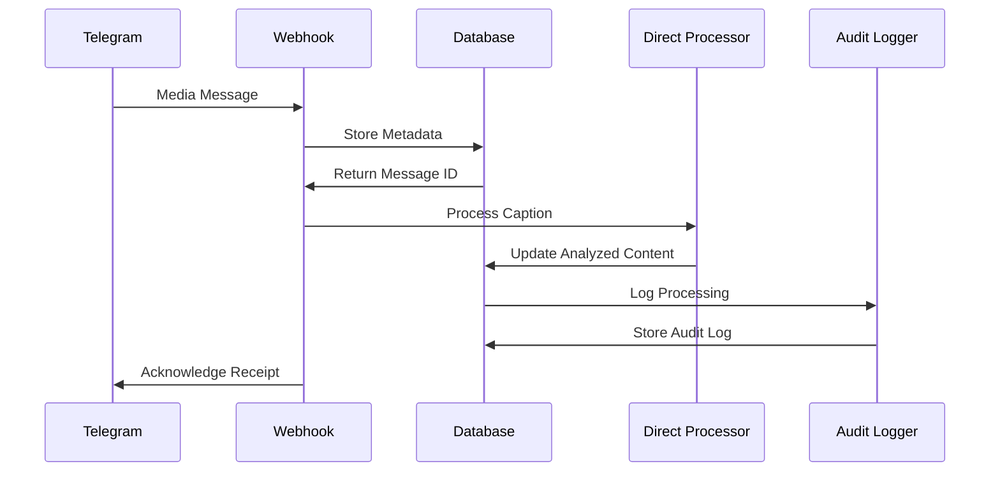
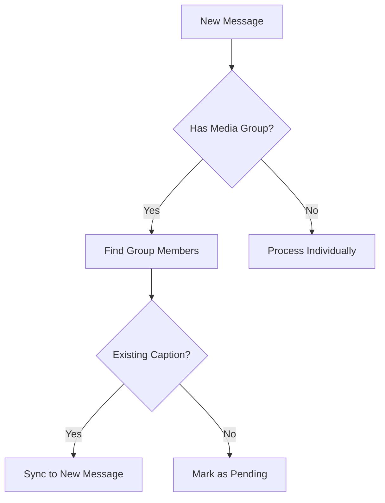

# Direct Caption Processing Flow

## Sequence Diagram


## Caption Analysis Process

### Pattern Matching Logic
The `direct-caption-processor` function uses the shared `xdelo_parseCaption` function from `_shared/captionParser.ts` which implements consistent pattern matching:

```typescript
// From _shared/captionParser.ts
export function xdelo_parseCaption(caption: string): ParsedContent {
  // Extract product name (text before '#')
  const productNameMatch = caption.match(/^(.*?)(?=#|\n|$)/);
  
  // Extract product code (text following '#')
  const productCodeMatch = caption.match(/#([A-Za-z0-9-]+)/);
  
  // Extract vendor UID (first 1-4 letters of product code)
  const vendorMatch = productCode.match(/^([A-Za-z]{1,4})/);
  
  // Extract purchase date (digits after vendor letters)
  const dateMatch = productCode.match(/^[A-Za-z]{1,4}(\d{5,6})/);
  
  // Extract quantity (number following 'x')
  const quantityMatch = caption.match(/x\s*(\d+)/i);
  
  // Extract notes (text in parentheses)
  const notesMatch = caption.match(/\(([^)]+)\)/);
}
```

## Media Group Synchronization


## Error Handling
```mermaid
gantt
    title Caption Processing Retry Flow
    dateFormat  HH:mm
    section Attempt
    Initial Processing    :a1, 13:00, 5m
    First Retry           :a2, after a1, 13:10, 5m
    Second Retry          :a3, after a2, 13:25, 5m
    Final Failure         :a4, after a3, 13:35, 5m
```

## Database Operations
```sql
-- Update message with parsed content
UPDATE messages
SET analyzed_content = $1,
    processing_state = 'completed',
    processing_completed_at = NOW()
WHERE id = $2
RETURNING *;
```

## Audit Logging
```typescript
// Log the processing event
await supabaseClient.from("unified_audit_logs").insert({
  event_type: 'caption_processed',
  entity_id: messageId,
  correlation_id: correlationId,
  metadata: {
    processing_time_ms: Date.now() - startTime,
    caption_length: caption.length,
    has_media_group: !!mediaGroupId,
    method: 'manual',
    is_edit: isEdit,
    force_reprocess: forceReprocess
  }
});
```

## Recovery Procedures
1. **Stalled Processing Detection**
```sql
SELECT * FROM messages
WHERE processing_state = 'processing'
AND processing_started_at < NOW() - INTERVAL '1 hour';
```

2. **Manual Reprocessing**
```typescript
// Reset processing state and trigger reprocessing
async function handleReprocess(messageId: string) {
  await supabase.rpc('xdelo_reset_processing_state', {
    message_id: messageId
  });
  
  // Call the direct processor function
  return supabase.functions.invoke('direct-caption-processor', {
    body: { 
      messageId: messageId,
      forceReprocess: true
    }
  });
}
```

## Integration Points

The `direct-caption-processor` function acts as a central integration point:

1. **Database Triggers**: Automatically invoked on message inserts/updates
2. **Frontend API**: Called directly from UI for manual reprocessing
3. **Edge Functions**: Used by other edge functions for caption processing
4. **Workflow Functions**: Integrated with database workflow functions

By centralizing caption processing logic in the shared `captionParser.ts` file and using the `direct-caption-processor` function as the primary processor, we ensure consistent parsing and processing across all integration points.
