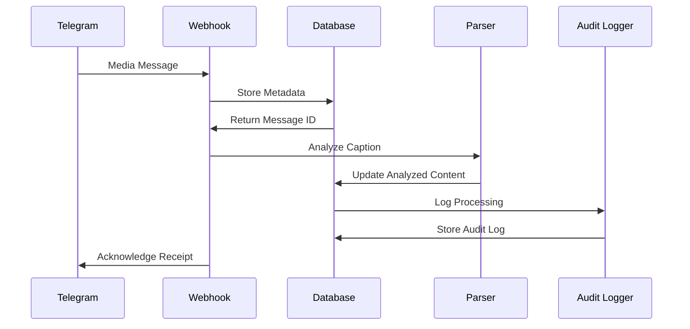
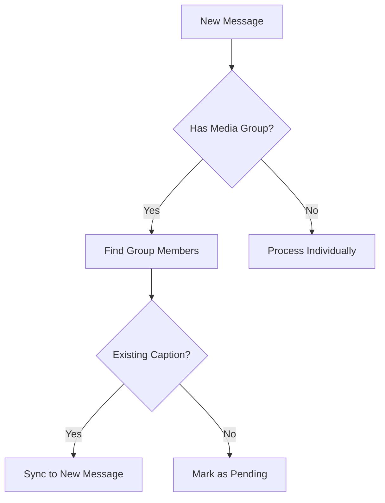

# Direct Caption Processing Flow

## Sequence Diagram


## Caption Analysis Process

### Pattern Matching Logic
```typescript
// From analysisHandler.ts
interface AnalysisResult {
  productName?: string;
  productCode?: string;
  vendorUID?: string;
  purchaseDate?: Date;
  quantity?: number;
  notes?: string;
}

function parseCaption(caption: string): AnalysisResult {
  // Extraction logic implementation
  return {
    productName: matchBeforeSeparator(caption),
    productCode: matchAfterHash(caption),
    vendorUID: extractVendorUID(caption),
    purchaseDate: parsePurchaseDate(caption),
    quantity: extractQuantity(caption),
    notes: extractNotes(caption)
  };
}
```

## Media Group Synchronization


## Error Handling
```mermaid
gantt
    title Caption Processing Retry Flow
    dateFormat  HH:mm
    section Attempt
    Initial Processing    :a1, 13:00, 5m
    First Retry           :a2, after a1, 13:10, 5m
    Second Retry          :a3, after a2, 13:25, 5m
    Final Failure         :a4, after a3, 13:35, 5m
```

## Database Operations
```sql
-- From dbOperations.ts
UPDATE messages
SET analyzed_content = $1,
    processing_state = 'completed',
    processing_completed_at = NOW()
WHERE id = $2
RETURNING *;
```

## Audit Logging
```typescript
// From logMessageEvent in dbOperations.ts
await supabase.from('unified_audit_logs').insert({
  event_type: 'caption_processed',
  entity_id: messageId,
  new_state: analyzedContent,
  metadata: {
    processing_time: Date.now() - startTime,
    caption_length: caption.length,
    media_group: !!mediaGroupId
  }
});
```

## Recovery Procedures
1. **Stalled Processing Detection**
```sql
SELECT * FROM messages
WHERE processing_state = 'processing'
AND processing_started_at < NOW() - INTERVAL '1 hour';
```

2. **Manual Reprocessing**
```typescript
// From analysisHandler.ts
async function handleReprocess(messageId: string) {
  await supabase.rpc('xdelo_reset_processing_state', {
    message_id: messageId
  });
  return triggerAnalysis(messageId);
}
