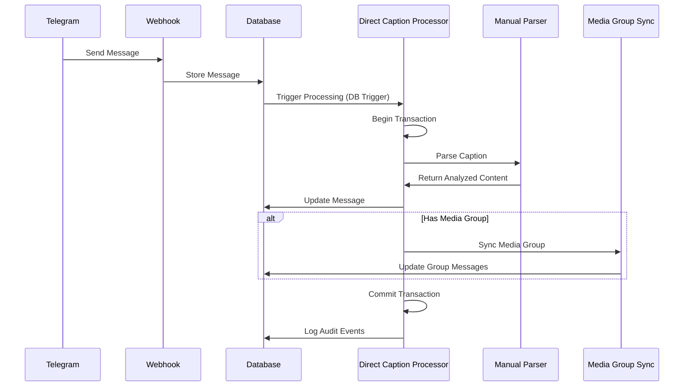

# Direct Caption Processing Flow

This document explains in detail how the direct caption processor works in the Telegram webhook system.

## Overview

The direct caption processor is responsible for analyzing captions from Telegram messages without using a queue system. It processes captions in real-time, using database transactions to ensure data consistency.

## Flow Diagram

## Triggering Mechanisms

The direct caption processor can be triggered in several ways:

1. **Database Trigger**: Automatically fires when a message with a caption is inserted or updated
2. **Edge Function**: Can be called manually via the `direct-caption-processor` edge function
3. **Scheduled Process**: Periodic job that finds pending messages and processes them

## Processing Steps

### 1. Initialization

When a message with a caption is detected:

- A correlation ID is assigned if not already present
- The message is marked as "processing"
- A transaction is begun using `xdelo_begin_transaction()`

### 2. Caption Analysis

The caption is analyzed using a multi-step approach:

1. **Pattern Matching**: 
   - Extract product name (text before '#')
   - Extract product code (text following '#')
   - Extract vendor UID (first 1-4 letters of product code)
   - Extract purchase date (parse date portion from product code)
   - Extract quantity (number following 'x' or similar indicators)

2. **Result Storage**:
   - Analyzed results are stored in a structured JSONB object
   - Includes all extracted fields and parsing metadata
   - Partial success is supported when certain fields can't be extracted
   - Transaction prevents partial updates

### 3. Media Group Handling

If the message is part of a media group:

- The message is marked as the original caption holder (`is_original_caption = true`)
- Advisory locks prevent concurrent updates to the same media group
- The analyzed content is synchronized to all messages in the group
- Group metadata is updated with message counts and timestamps

### 4. Transaction Completion

After processing:

- The transaction is committed using `xdelo_commit_transaction_with_sync()`
- The message state is set to "completed" or "partial_success"
- All changes are logged to the unified audit log

## Error Handling

If an error occurs during processing:

1. **Transaction Rollback**:
   - The transaction is rolled back to maintain consistency
   - The message is marked with error state
   - Error details are logged

2. **Automatic Retry**:
   - Failed messages can be automatically retried
   - Retry count is tracked in the message record
   - Exponential backoff prevents rapid retry cycles
   - Maximum retry attempts prevent endless loops

3. **Fallback Processing**:
   - If direct processing fails, message is queued for later processing
   - Edge function fallbacks with different parsing strategies
   - Direct database fallbacks for media group syncing

## Partial Success Handling

When messages can be partially processed:

1. **Partial Success State**:
   - New `partial_success` state for messages with some but not all fields
   - Missing fields are tracked in the metadata
   - Vendor UID and purchase date are now optional

2. **Media Group Sync**:
   - Partial content is still synced to media groups
   - Ensures consistent state across all group messages
   - Allows for updates when more complete information arrives

## Recovery Mechanisms

For handling edge cases and failures:

1. **Manual Reprocessing**:
   - The `handleReanalyze` function allows manual reprocessing of a message
   - Bypasses normal flow and forces direct processing

2. **Stalled Message Recovery**:
   - The `xdelo_reset_stalled_messages()` function identifies and resets messages stuck in "processing" state
   - Daily maintenance job automatically resets stalled messages

3. **Media Group Repair**:
   - The `xdelo_repair_media_group_syncs()` function fixes inconsistencies in media groups
   - Identifies groups with mixed processing states and repairs them

## Monitoring and Health Checks

Comprehensive health monitoring for the processing system:

1. **Processing Stats**:
   - Track counts by processing state
   - Monitor stalled messages
   - Detect mixed media groups (partially processed)

2. **Scheduled Maintenance**:
   - Cron jobs run at regular intervals to fix stalled messages
   - Reset stuck processes and advisory locks
   - Repair broken media group relationships

3. **Manual Intervention**:
   - Admin UI for direct repair operations
   - Diagnostic functions to identify problematic messages
   - Tools to force reprocessing of specific messages

## Transaction Management

Transaction-based processing ensures consistency:

1. **Transaction Functions**:
   - `xdelo_begin_transaction`: Initializes transaction with unique ID
   - `xdelo_commit_transaction_with_sync`: Commits with group synchronization
   - `xdelo_update_message_with_analyzed_content`: Atomic message updates
   - `xdelo_handle_failed_caption_analysis`: Consistent error handling

2. **Advisory Locks**:
   - Prevent race conditions on media group updates
   - Ensure only one process updates a group at a time
   - Allow parallel processing of unrelated groups
   - Get automatically released when a transaction ends or connection terminates

## Progressive and Immediate Media Group Sync

Improved media group synchronization:

1. **Immediate Sync**:
   - Media groups are synced immediately after processing a caption
   - No waiting for scheduled processes or triggers
   - Multiple fallback mechanisms for reliability

2. **Progressive Sync**:
   - New messages without captions check for existing group content
   - Automatically inherit analyzed content if available
   - Scheduled re-checks for groups that had no content initially
   - Delayed re-processing attempts for better sync rates
