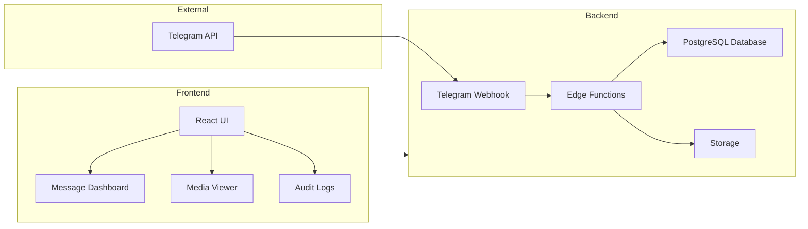

# Technical Context: xdelo-app

## Architecture Overview

The xdelo-app follows a modern serverless architecture leveraging Supabase for backend services and React for the frontend. The system is designed to be scalable, maintainable, and resilient to failures.



## Database Schema

### Core Tables

#### `messages` Table
Stores media messages from Telegram with the following key fields:
- `id`: UUID (Primary Key)
- `telegram_message_id`: Telegram's message ID
- `chat_id`: Telegram chat ID
- `file_unique_id`: Unique identifier for files from Telegram (Unique Constraint)
- `caption`: Text caption for media
- `analyzed_content`: JSONB field containing parsed caption data
- `old_analyzed_content`: JSONB array for storing previous analyzed content
- `processing_state`: Current processing state (enum type)
- `media_group_id`: For grouping related media messages

#### `other_messages` Table
Stores text-only messages and potentially other non-media message types.

### Key Indexes
- `idx_file_unique_id`: For finding messages by file_unique_id
- `idx_messages_media_group_id`: For finding related messages in a group
- `idx_messages_chat_telegram_message_id`: For finding messages by chat and message ID

## Core Components

### 1. Telegram Webhook Handler
- Entry point for all Telegram updates
- Determines message context (channel post, forwarded, edited)
- Routes messages based on type

### 2. Media Processing Pipeline
- `MediaProcessor` class handles:
  - MIME type detection and validation
  - File extension determination
  - Storage path generation
  - Media download from Telegram
  - Media upload to Supabase Storage
  - Duplicate detection and handling

### 3. Caption Analysis System
- Pattern-based extraction of:
  - Product Name
  - Product Code
  - Vendor UID
  - Purchase Date
  - Quantity
- Handles partial success cases with metadata tracking

### 4. Media Group Synchronization
- Immediate synchronization when:
  - New message in group received
  - Caption edited
  - Force reprocessing requested
- Multi-layer fallback system:
  - Edge function synchronization (primary)
  - Direct DB function (fallback)
  - Manual repair tools (last resort)

### 5. Error Handling and Recovery
- Transaction management for critical sections
- Automatic retry mechanism with exponential backoff
- Manual intervention tools for complex cases

## Technical Debt and Refactoring

### Legacy Code
Functions in `mediaUtils.ts` that are now duplicated in `MediaProcessor` class:
- `xdelo_isViewableMimeType` → `MediaProcessor.isViewableMimeType`
- `xdelo_getExtensionFromMimeType` → `MediaProcessor.getExtensionFromMimeType`
- `xdelo_detectMimeType` → `MediaProcessor.detectMimeType`
- `xdelo_generateStoragePath` → `MediaProcessor.generateStoragePath`
- `xdelo_validateAndFixStoragePath` → `MediaProcessor.generateStoragePath`
- `xdelo_getUploadOptions` → Handled internally in `MediaProcessor.uploadMediaToStorage`
- `xdelo_findExistingFile` → `MediaProcessor.findExistingFile`
- `xdelo_verifyFileExists` → `MediaProcessor.verifyFileExists`
- `xdelo_uploadMediaToStorage` → `MediaProcessor.uploadMediaToStorage`
- `xdelo_downloadMediaFromTelegram` → `MediaProcessor.downloadMediaFromTelegram`
- `xdelo_processMessageMedia` → `MediaProcessor.processMedia`

### Migration Strategy
- Add deprecation notices to legacy functions
- Update all imports to use new `MediaProcessor` class
- Create adapter functions for backward compatibility if needed
- Eventually remove legacy functions after all code is migrated

## Critical Interfaces

### `ProcessingResult` Interface
```typescript
interface ProcessingResult {
  success: boolean;
  fileId?: string;
  fileUniqueId?: string; // Critical for proper file identification
  storagePath?: string;
  publicUrl?: string;
  mimeType?: string;
  error?: Error;
}
```

### Message Processing States
```typescript
type ProcessingState = 
  | 'initialized' // Initial state for new messages
  | 'pending'     // Ready for caption analysis
  | 'processing'  // Analysis in progress
  | 'completed'   // Successfully processed
  | 'error';      // Processing failed
```

## Deployment and Environment

### Required Services
- Supabase PostgreSQL
- Supabase Storage
- Telegram Bot API
- Deno Edge Functions

### Environment Variables
```
TELEGRAM_BOT_TOKEN=your_bot_token
TELEGRAM_API_ID=your_api_id
TELEGRAM_API_HASH=your_api_hash
SUPABASE_URL=your_supabase_url
SUPABASE_ANON_KEY=your_supabase_anon_key
SUPABASE_SERVICE_ROLE_KEY=your_supabase_service_role_key
```

## Monitoring and Maintenance

### Key Metrics
- Messages processed/minute
- Error rate by category
- Media group sync success rate
- Average processing latency

### Scheduled Jobs
- Daily maintenance: `0 3 * * * xdelo_daily_maintenance`
- 5-minute retries: `*/5 * * * * xdelo_process_pending_messages`

## Development Guidelines

### Code Style
- Follow Airbnb Style Guide
- Use TypeScript with strict typing
- Document public classes and methods with JSDoc
- Avoid using `any` type
- Create necessary types for all data structures

### Architecture Principles
- DRY (Don't Repeat Yourself)
- Single Responsibility
- Feature-Based Organization
- Typed Database Access
