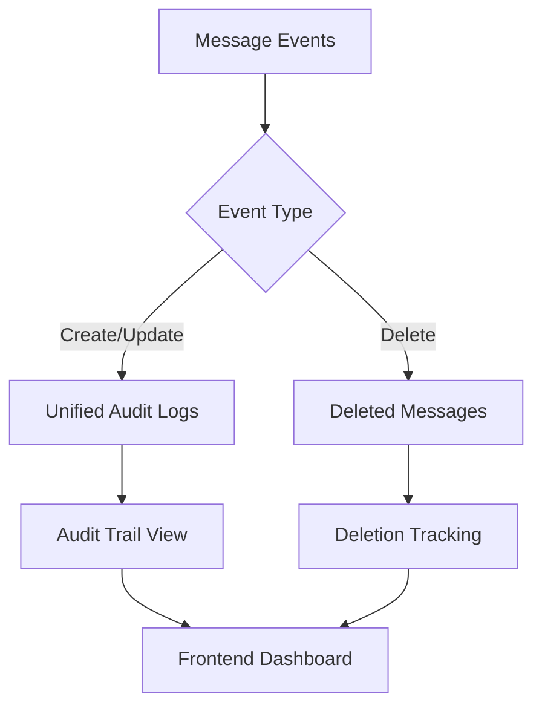
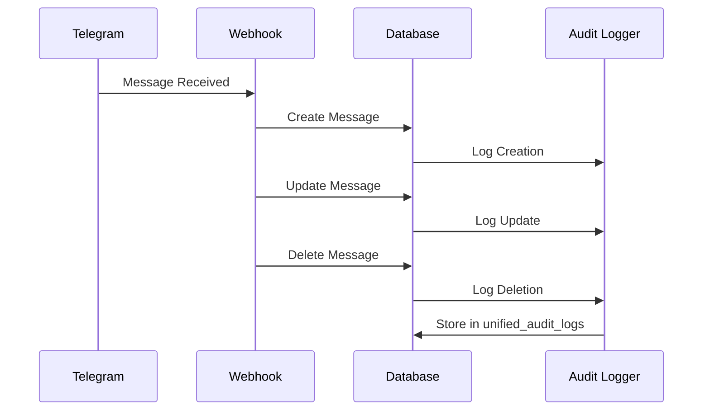
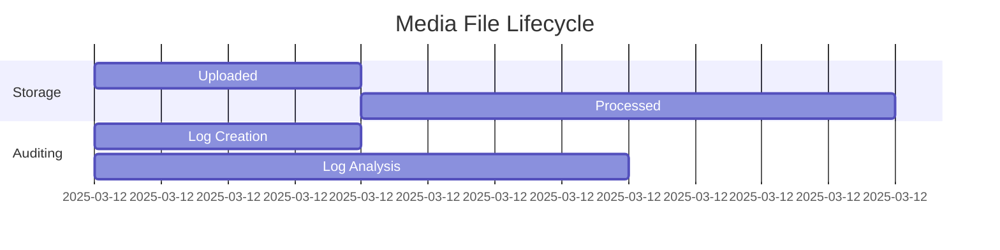
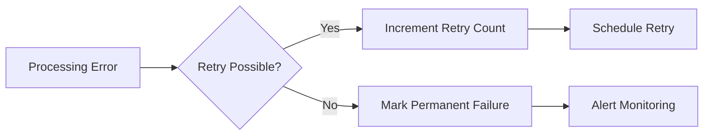

# Simplified Audit Logging System

## Architecture Overview



## Core Components

### 1. Unified Audit Logs Table
```sql
CREATE TABLE unified_audit_logs (
  id UUID PRIMARY KEY DEFAULT gen_random_uuid(),
  event_type audit_event_type NOT NULL,
  entity_id UUID NOT NULL, -- Message ID
  previous_state JSONB,
  new_state JSONB,
  metadata JSONB,
  error_message TEXT,
  event_timestamp TIMESTAMPTZ DEFAULT NOW()
);
```

### 2. Enhanced Message Processing Flow


## Media Handling Audit Trail

### File Lifecycle Tracking


## Frontend Integration

### Audit Log Query Interface
```typescript
interface AuditLogQuery {
  messageId?: string;
  correlationId?: string;
  startDate?: Date;
  endDate?: Date;
  eventTypes?: AuditEventType[];
}

const fetchAuditLogs = async (query: AuditLogQuery) => {
  return supabase
    .from('unified_audit_logs')
    .select('*')
    .filter('entity_id', 'eq', query.messageId)
    .filter('event_type', 'in', `(${query.eventTypes?.join(',')})`);
};
```

## Error Recovery Patterns



## Example Queries

1. Get all edits for a message:
```sql
SELECT * FROM unified_audit_logs
WHERE event_type = 'message_updated'
AND entity_id = 'message-uuid'
ORDER BY event_timestamp DESC;
```

2. Find failed processing attempts:
```sql
SELECT * FROM unified_audit_logs
WHERE event_type = 'processing_error'
AND metadata->>'correlation_id' = 'cid-1234';
```

3. Audit trail for media group:
```sql
SELECT * FROM v_message_audit_trail
WHERE metadata->>'media_group_id' = 'mg-5678';
