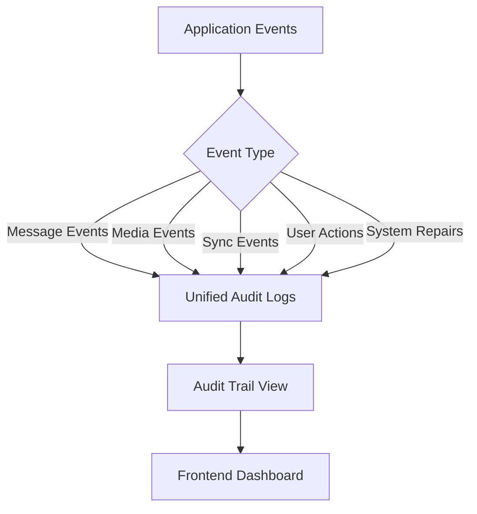
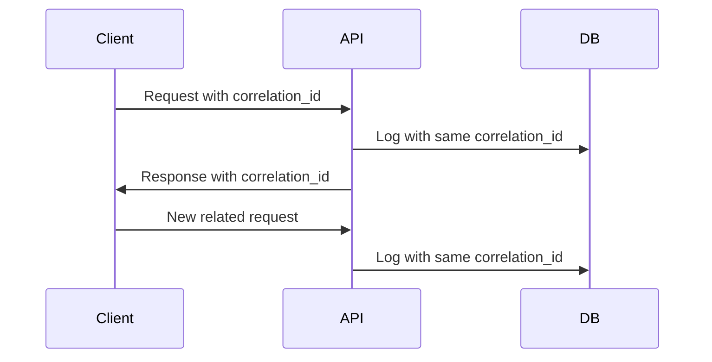

# Simplified Audit Logging System

## Architecture Overview



## Core Components

### 1. Unified Audit Logs Table
```sql
CREATE TABLE unified_audit_logs (
  id UUID PRIMARY KEY DEFAULT gen_random_uuid(),
  event_type TEXT NOT NULL,
  entity_id UUID NOT NULL,
  previous_state JSONB,
  new_state JSONB,
  metadata JSONB,
  error_message TEXT,
  correlation_id UUID,
  event_timestamp TIMESTAMPTZ DEFAULT NOW()
);
```

### 2. LogEventType Enum
The `LogEventType` enum provides standardized event types across the application:

```typescript
export enum LogEventType {
  // Message events
  MESSAGE_CREATED = 'message_created',
  MESSAGE_UPDATED = 'message_updated',
  MESSAGE_DELETED = 'message_deleted',
  // ... more events
}
```

## Logging Functions

### Client-Side Logging
```typescript
// Log any event
logEvent({
  eventType: LogEventType.MESSAGE_UPDATED,
  entityId: "message-uuid",
  previousState: { /* old state */ },
  newState: { /* new state */ },
  metadata: { /* custom metadata */ }
});

// Log a message event (simplified)
logMessageEvent(
  LogEventType.MESSAGE_UPDATED,
  "message-uuid",
  { /* metadata */ }
);

// Log a sync operation
logSyncOperation(
  "sync_products",
  "entity-uuid",
  { /* details */ },
  true // success
);
```

### Server-Side Logging
```typescript
// In Edge Functions
xdelo_logProcessingEvent(
  "message_processed",
  "message-uuid",
  "correlation-id",
  { /* metadata */ }
);

// In Database Functions
SELECT xdelo_log_operation(
  'message_updated',
  message_id,
  '{"user": "system"}'::jsonb
);
```

## Correlation ID Tracking

All logs include a correlation ID for request tracing:



## Migration from Legacy Logging

Legacy logging functions are maintained for backward compatibility:

```typescript
// Old way (deprecated but still works)
logMessageOperation("update", "message-uuid", { /* metadata */ });

// New way (preferred)
logMessageEvent(LogEventType.MESSAGE_UPDATED, "message-uuid", { /* metadata */ });
```

## Example Queries

1. Get all events for a specific entity:
```sql
SELECT * FROM unified_audit_logs
WHERE entity_id = 'entity-uuid'
ORDER BY event_timestamp DESC;
```

2. Find all errors:
```sql
SELECT * FROM unified_audit_logs
WHERE error_message IS NOT NULL
ORDER BY event_timestamp DESC;
```

3. Trace a request using correlation ID:
```sql
SELECT * FROM unified_audit_logs
WHERE correlation_id = 'correlation-uuid'
ORDER BY event_timestamp;
```

## Best Practices

1. Always include a correlation ID for related operations
2. Use standard event types from LogEventType enum
3. Put detailed information in metadata
4. Include timestamps in metadata for precise timing
5. For user actions, always include user_id in metadata
