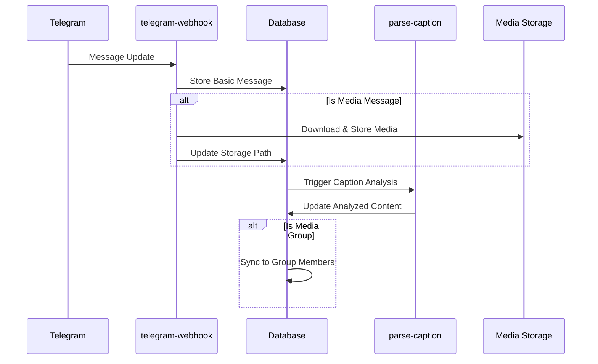
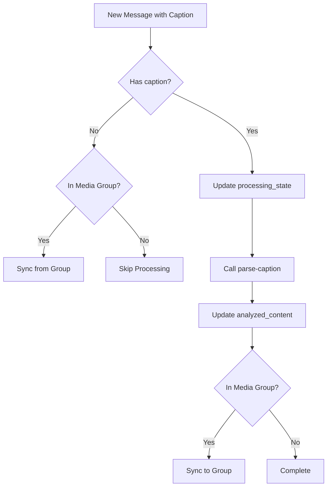

# Telegram Webhook Processing Flow

This document outlines the architecture, data flow, and components of the Telegram webhook system.

## Overview

The Telegram webhook system processes incoming messages from Telegram and stores them in the database. It handles:

1. Media messages (photos, videos, documents)
2. Text messages
3. Caption parsing and analysis
4. Media group synchronization
5. Forwarded messages
6. Edited messages

## Architecture Components

### Edge Functions

| Function | Purpose | Status |
|----------|---------|--------|
| `telegram-webhook` | Main entry point for Telegram updates | Active |
| `parse-caption` | Analyzes message captions | Active, Needs Repair |
| `direct-caption-processor` | Direct API endpoint for caption processing | Active |
| `manual-caption-parser` | Fallback parser with pattern matching | Active |
| `media-management` | Handles media file operations | Active |
| `xdelo_unified_media_repair` | Repairs missing or corrupted media | Active |

### Database Functions

| Function | Purpose | Status |
|----------|---------|--------|
| `xdelo_process_caption_workflow` | Orchestrates caption analysis | Needs Repair |
| `xdelo_sync_media_group_content` | Synchronizes media group captions | Active |
| `xdelo_check_media_group_content` | Checks for existing content in media groups | Active |
| `xdelo_standardize_storage_paths` | Ensures consistent file paths | Active |
| `xdelo_set_public_url` | Generates public URLs for stored media | Active (Trigger) |

### Database Triggers

| Trigger | Function | Purpose |
|---------|----------|---------|
| `trg_process_caption` | `xdelo_process_caption_trigger` | Processes new captions |
| `trg_check_media_group_on_message_change` | `xdelo_check_media_group_on_message_change` | Handles media group synchronization |
| `trg_set_file_id_expiration` | `xdelo_set_file_id_expiration` | Sets expiration for file IDs |
| `trg_extract_analyzed_content` | `xdelo_extract_analyzed_content` | Extracts fields from analyzed_content |

## Data Flow

### Message Processing Flow

### Caption Analysis Flow

## Current Issues

1. **Database Function Repair Needed**: `xdelo_process_caption_workflow` is failing due to using the deprecated `http_post` function instead of the proper `pg_net.http_post` function.

2. **Caption Processing**: Messages are not being properly processed because the trigger function is not successfully calling the edge function for analysis.

3. **Message States**: Many messages are stuck in the 'processing' state due to failed analysis attempts.

## Message Processing States

- `initialized`: Initial state after message is received
- `pending`: Ready for caption analysis
- `processing`: Currently being analyzed
- `completed`: Analysis successfully completed
- `error`: Analysis failed with error

## Required Fixes

1. **Update Database Function**: Fix `xdelo_process_caption_workflow` to use the proper `pg_net.http_post` function from the Supabase pg_net extension.

2. **Verify Trigger Function**: Ensure `trg_process_caption` trigger correctly calls `xdelo_process_caption_workflow`.

3. **Add Error Handling**: Improve error handling and retry logic for failed caption processing.

## Implementation Plan

1. Create SQL migration to update the `xdelo_process_caption_workflow` function
2. Verify the parse-caption edge function is working correctly
3. Reset stuck messages to allow reprocessing
4. Test the entire flow with new messages

## Webhook Flow Details

The webhook flow begins when Telegram sends an update to the webhook URL. The webhook function processes the update and stores it in the database. The database triggers then analyze the caption and extract relevant information.

### Core Processing Steps

1. **Receive Update**: Telegram sends update to webhook endpoint
2. **Message Type Detection**: Determine if it's a text, media, edit, or forwarded message
3. **Message Creation**: Store basic message data in database
4. **Media Processing**: Download media files for media messages
5. **Caption Analysis**: Trigger analysis for messages with captions
6. **Media Group Handling**: Synchronize content across media group members
7. **Notification**: Send notifications about new messages via webhooks
