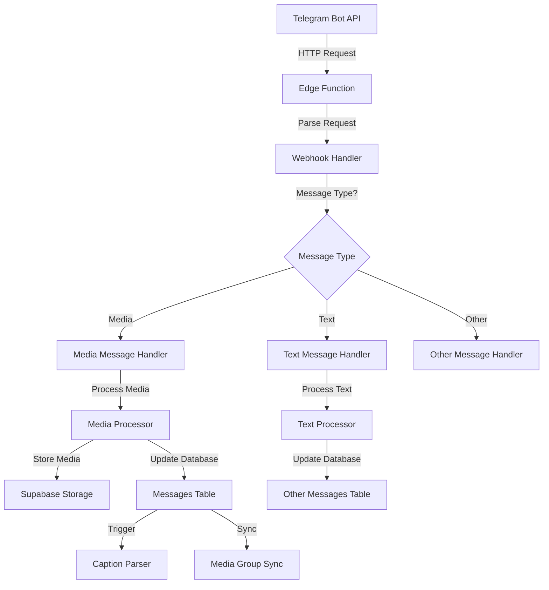

# Telegram Webhook Flow

This document provides a comprehensive overview of the Telegram webhook system architecture, processing flow, and key components.

## Architecture Overview

The Telegram webhook system processes incoming messages from Telegram's Bot API through a series of handlers and utilities. The system follows these key design principles:

1. **Correlation tracking**: Every request is assigned a unique correlation ID for comprehensive tracing
2. **Error resilience**: Robust error handling with detailed logging for troubleshooting
3. **Media processing**: Advanced media handling with proper MIME type detection and storage
4. **Caption analysis**: Sophisticated caption parsing with history preservation
5. **Media group synchronization**: Ensures consistency across grouped media items

## Webhook Processing Flow

## Key Components

### 1. Webhook Handler (`telegram-webhook/index.ts`)

The entry point for all Telegram webhook requests. It:
- Validates the Telegram bot token
- Parses the incoming Telegram update
- Extracts the message or edited message
- Routes to the appropriate message handler
- Handles CORS and responses

### 2. Message Handlers

#### Media Message Handler (`mediaMessageHandler.ts`)

Processes photo, video, audio, document, and other media messages:
- Extracts media content from different message types
- Processes both new and edited messages
- Handles duplicated media messages with updated captions
- Manages caption parsing and media group synchronization

#### Text Message Handler (`textMessageHandler.ts`)

Processes text messages and commands:
- Handles both new and edited text messages
- Extracts entities and structured data
- Routes messages to appropriate command handlers

### 3. Media Processor (`MediaProcessor.ts`)

Core component for processing media files:
- Detects and validates MIME types
- Generates standardized storage paths
- Downloads media from Telegram
- Uploads to Supabase storage
- Extracts file metadata
- Handles media optimization

### 4. Database Operations (`dbOperations.ts`)

Manages all database interactions:
- Upserts media and text messages
- Finds messages by various identifiers
- Updates message records
- Triggers caption parsing
- Synchronizes media group captions
- Logs processing events for audit

## Duplicate Media Message Handling

The system employs sophisticated handling for duplicate media messages with different captions:

### Detection & Processing Flow

1. **Duplicate Detection**:
   - Primary key for detection is `file_unique_id` from Telegram
   - When a message has the same `file_unique_id` as an existing record, it's identified as a duplicate

2. **Caption Change Handling**:
   - Compares existing caption with incoming caption
   - If caption has changed, triggers specialized update flow:
     - Preserves previous analysis by moving current `analyzed_content` to `old_analyzed_content` array
     - Resets `processing_state` to "initialized" to trigger reprocessing
     - Updates the caption and related fields
     - Triggers caption parsing for the new content

3. **Media Group Synchronization**:
   - If the message is part of a media group, synchronizes caption changes to all related messages
   - Ensures consistent caption and analysis across all media in the same group
   - Maintains proper processing state across the group

## Database Schema

### Messages Table

Stores all media messages with the following key fields:

| Field | Type | Description |
|-------|------|-------------|
| `id` | UUID | Primary key |
| `telegram_message_id` | BIGINT | Message ID from Telegram |
| `chat_id` | BIGINT | Chat ID from Telegram |
| `file_unique_id` | TEXT | Unique file ID (with constraint) |
| `file_id` | TEXT | File ID for Telegram API |
| `storage_path` | TEXT | Path in Supabase storage |
| `public_url` | TEXT | URL to access media |
| `mime_type` | TEXT | MIME type of media |
| `extension` | TEXT | File extension |
| `caption` | TEXT | Caption text |
| `caption_data` | JSONB | Processed caption data |
| `analyzed_content` | JSONB | Parsed caption content |
| `old_analyzed_content` | JSONB[] | Array of previous analyses |
| `processing_state` | ENUM | Current processing state |
| `media_group_id` | TEXT | Group ID for grouped media |
| `message_data` | JSONB | Complete Telegram message |

### Other Messages Table

Stores text and other non-media messages:

| Field | Type | Description |
|-------|------|-------------|
| `id` | UUID | Primary key |
| `telegram_message_id` | BIGINT | Message ID from Telegram |
| `chat_id` | BIGINT | Chat ID from Telegram |
| `message_text` | TEXT | Text content |
| `analyzed_content` | JSONB | Parsed message content |
| `processing_state` | ENUM | Current processing state |
| `message_data` | JSONB | Complete Telegram message |

## Error Handling & Logging

The system implements a comprehensive error handling strategy:

1. **Standardized Error Responses**: All errors follow a consistent format with:
   - Detailed error message
   - HTTP status code
   - Correlation ID for tracing
   - Context information

2. **Unified Audit Logging**: All significant events are logged to the `unified_audit_logs` table:
   - Process starts and completions
   - State transitions
   - Error conditions
   - Media processing outcomes
   - Caption parsing results

3. **Error Recovery**: Includes mechanisms for:
   - Retrying failed operations
   - Graceful degradation when components fail
   - Maintaining system stability under error conditions

## Media Types & Processing

### Photos
- Takes the largest photo in the array (`message.photo[message.photo.length - 1]`)
- Stores dimensions (width, height)
- Generates optimized JPG/JPEG format

### Videos
- Stores with proper MIME type and extension
- Extracts duration and dimensions when available
- Handles video notes (circular videos) as specialized type

### Documents
- Preserves original filename when available
- Detects MIME type from file extension or content
- Special handling for common document types (PDF, spreadsheets, etc.)

### Audio
- Handles voice messages and audio files
- Extracts duration and metadata
- Manages proper file extensions based on format

## Webhook Security

The system implements several security measures:

1. **Token Validation**: Validates Telegram bot token on every request
2. **IP Restriction**: Can be configured to only accept requests from Telegram's IP ranges
3. **CORS Controls**: Implements proper CORS headers and preflight handling
4. **Rate Limiting**: Prevents abuse through request rate limiting
5. **Error Concealment**: Avoids leaking sensitive information in error messages

## PostgreSQL Functions

The system leverages several custom PostgreSQL functions:

1. **upsert_media_message**: Creates or updates media message records
   - Handles duplicate detection via `file_unique_id`
   - Manages caption changes with history preservation
   - Coordinates with media group synchronization

2. **sync_media_group_captions**: Synchronizes captions across media groups
   - Propagates caption changes to all messages in the group
   - Maintains consistent processing state and analysis

3. **trigger_caption_parsing**: Initiates caption analysis processes
   - Called when captions change or are newly added
   - Manages the analysis workflow

4. **update_message_analyzed_content**: Updates analysis results
   - Preserves history in `old_analyzed_content`
   - Maintains proper state transitions

## Development & Testing

### Local Development
- Environment variables are managed via `.env` files
- Testing can use the Telegram Bot API's webhook simulation

### Deployment
- Functions are deployed as Supabase Edge Functions
- CI/CD pipeline ensures proper deployment steps

### Logging Levels
- ERROR: Unexpected errors that require intervention
- WARNING: Issues that don't break functionality but are noteworthy
- INFO: Normal operational events
- DEBUG: Detailed information for troubleshooting
