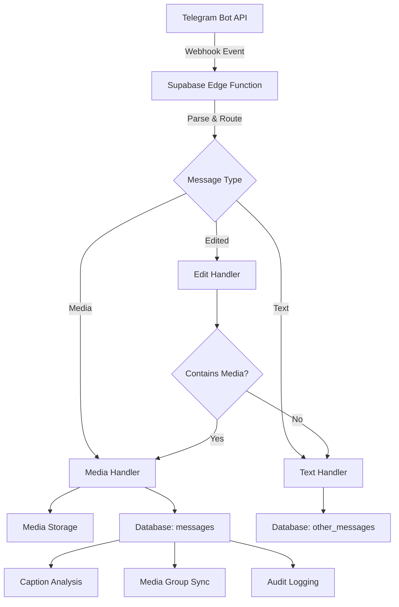
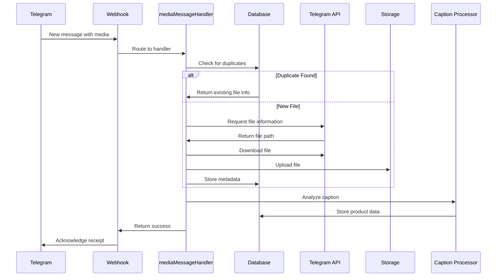
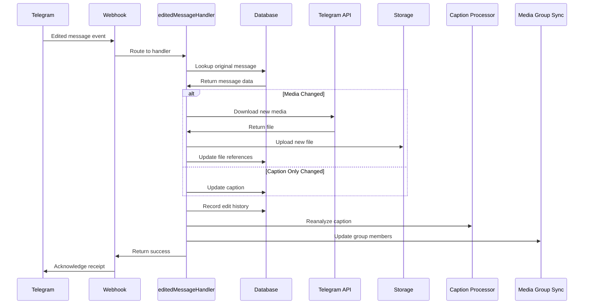

# Telegram Webhook Flow Documentation

This document provides a comprehensive overview of the Telegram webhook implementation, including how it handles different types of messages, stores media, manages message edits, tracks forwarded messages, and handles duplicate detection.

## System Architecture

The Telegram webhook is implemented as a Supabase Edge Function that receives updates from the Telegram Bot API whenever a new message is sent to the bot. The system follows this high-level architecture:



## Webhook Entry Point

The primary entry point is `index.ts`, which receives all webhook events from Telegram, identifies the message type, and routes it to the appropriate handler:

1. **Initialization**: Creates a correlation ID for request tracing
2. **Message Extraction**: Extracts message data from various update types
3. **Context Building**: Determines message context (forwarded, edited, channel post)
4. **Routing**: Routes to appropriate handler based on message type
   - Media messages → `handleMediaMessage`
   - Edited messages → `handleEditedMessage`
   - Other messages → `handleOtherMessage`

## Message Types & Handling

### Media Messages

Media messages (photos, videos, documents) are processed by `mediaMessageHandler.ts`:

1. **Duplicate Detection**: Checks if the file has been seen before (based on `file_unique_id`) and review if its in the storage -> will still reprocess caption and parsing and media group syncing everytime
2. **Media Download**: Downloads media from Telegram to Supabase Storage and properly sets the content type for supabase to display public_url for images and videos and uploaded medias
3. **Database Storage**: Stores metadata in the `messages` table
4. **Caption Processing**: Extracts product information from captions

Media Group handling:
- Messages with the same `media_group_id` are treated as a group
- Caption from one message can be synchronized across the group
- Media groups are identified and linked together

### Edited Messages

Edited messages are processed by `editedMessageHandler.ts`:

1. **Original Message Lookup**: Finds the original message in the database
2. **Edit Tracking**: Records edit history including:
   - Previous caption/content
   - Edit timestamp
   - Changes in media (if applicable)
3. **Media Changes**: If media was replaced:
   - Downloads new media from Telegram
   - Updates storage and database records
   - Preserves edit history
4. **Caption**: always reprocess and update caption
   - reset the caption and parsing and media group syncing logic 
   - Updates caption in database set procesing state back to processing if it has a caption
   - Reprocesses caption for product information
   - Synchronizes changes across media groups

### Text Messages

Non-media messages are processed by `textMessageHandler.ts`:

1. **Database Storage**: Stored in the `other_messages` table
2. **Edit Handling**: For edited text messages:
   - Maintains edit history
   - Updates message content
   - Records edit metadata
3. Falls back to just storing the telegram webhook data as a jsonb as a error handling

## Forwarded Messages

Forwarded messages have special handling:

1. **Origin Detection**: Identifies message source:
   - Original chat ID
   - Original message ID
   - Forward source (user, channel)
2. **Metadata Storage**: Records forward information in the `forward_info` field
3. **Relationship Tracking**: Maintains relationships between original and forwarded content
4. Update the caption and analyzed_content product info with the new info from the forwwarded content if it has a duplicate then sync changes with media group

## Media Storage & Management

Media files are managed by `mediaUtils.ts`:

1. **Download Process**:
   - Retrieves file information from Telegram
   - Downloads the actual file content with proper mime content type decloration for public url sharing of images videos from supabase buckets
   - Uses retry logic with exponential backoff
   - Handles timeouts and network errors
2. **Storage Organization**:
   - Files are stored using their `file_unique_id` as a unique identifier
   - Standard file extensions based on MIME types
   - Files are stored in Supabase Storage under `telegram-media` bucket

## Database Schema

### Messages Table

Stores media messages with fields:

```
- id: UUID (primary key)
- telegram_message_id: int (Telegram's message identifier)
- chat_id: int (Telegram chat identifier)
- chat_type: string (group, private, channel)
- chat_title: string (optional, for groups/channels)
- media_group_id: string (optional, for grouped media)
- caption: string (optional message caption)
- file_id: string (Telegram file identifier)
- file_unique_id: string (Telegram's permanent unique file ID)
- mime_type: string (e.g., image/jpeg, video/mp4)
- file_size: int (bytes)
- width/height: int (for photos/videos)
- duration: int (for videos, in seconds)
- storage_path: string (location in Supabase Storage)
- public_url: string (direct URL to media)
- processing_state: enum ('pending', 'processing', 'completed', 'error')
- analyzed_content: JSON (extracted product data)
- old_analyzed_content: JSON array (history of product data from edits)
- telegram_data: JSON (full Telegram message data)
- forward_info: JSON (metadata about forwarded messages)
- edit_history: JSON array (record of edits)
- edit_count: int (number of edits)
- needs_redownload: boolean (flag for failed downloads)
- storage_exists: boolean (verification flag)
```

### Other Messages Table

Stores non-media messages with fields:

```
- id: UUID (primary key)
- telegram_message_id: int
- chat_id: int
- chat_type: string
- chat_title: string (optional)
- message_type: string
- message_text: string
- telegram_data: JSON
- processing_state: enum ('pending', 'processing', 'completed', 'error')
- is_forward: boolean
- edit_history: JSON array
- edit_count: int
- correlation_id: string (for request tracing)
```

### Unified Audit Logs

Records all operations for tracking and debugging:

```
- id: UUID (primary key)
- event_type: string (e.g., 'message_created', 'processing_state_changed')
- entity_id: UUID (reference to message)
- telegram_message_id: int
- chat_id: int
- previous_state: JSON (state before change)
- new_state: JSON (state after change)
- metadata: JSON (contextual information)
- event_timestamp: timestamp
- correlation_id: string
```

## Duplicate Detection

The system prevents duplicate message storage through:

1. **File Uniqueness Check**: Using Telegram's `file_unique_id` as a stable identifier
2. **Database Lookup**: Checking if file has been previously processed
3. **Smart Reuse**: If duplicate is detected:
   - Uses existing storage path and file information
   - Updates message metadata if needed
   - Links to existing file rather than re-downloading

## Audit Logging

All operations are logged for traceability using the `unified_audit_logs` table:

1. **Event Tracking**:
   - Message creation/modification
   - Processing state changes
   - File operations
   - Analysis results
2. **Logging Context**:
   - Records both previous and new states
   - Tracks correlation IDs for request tracing
   - Preserves event timestamps
   - Maintains entity relationships

## Media Group Synchronization

For media groups (multiple files sent together):

1. **Group Detection**: Messages with the same `media_group_id` are linked
2. **Caption Propagation**: Caption from one message can be applied to all group members
3. **Shared Analysis**: Product data extracted from caption is synchronized
4. **Edit Consistency**: Edits to one group member can propagate to others


## Processing States

Messages go through several processing states:

1. **Pending**: Initial state after message is received
2. **Processing**: Active data extraction/analysis
3. **Completed**: Successfully processed
4. **Error**: Failed processing with error details

## Workflow Examples

### New Media Message Flow



### Edited Message Flow



## How to Extend

### Adding New Message Types

1. Create a new handler in the `handlers` directory
2. Add routing logic to `index.ts`
3. Implement required database operations

### Modifying Media Storage

1. Update functions in `mediaUtils.ts`
2. Adjust storage path generation and file naming logic
3. Update MIME type handling if needed

### Enhancing Caption Processing

1. Modify direct-caption-processor function
2. Adjust parsing logic and data extraction
3. Update `analyzed_content` schema if needed

## Best Practices

1. Always check for duplicate files before downloading
2. Maintain complete edit history for audit trails
3. Use correlation IDs for request tracing
6. Centralize logging for consistent event tracking
