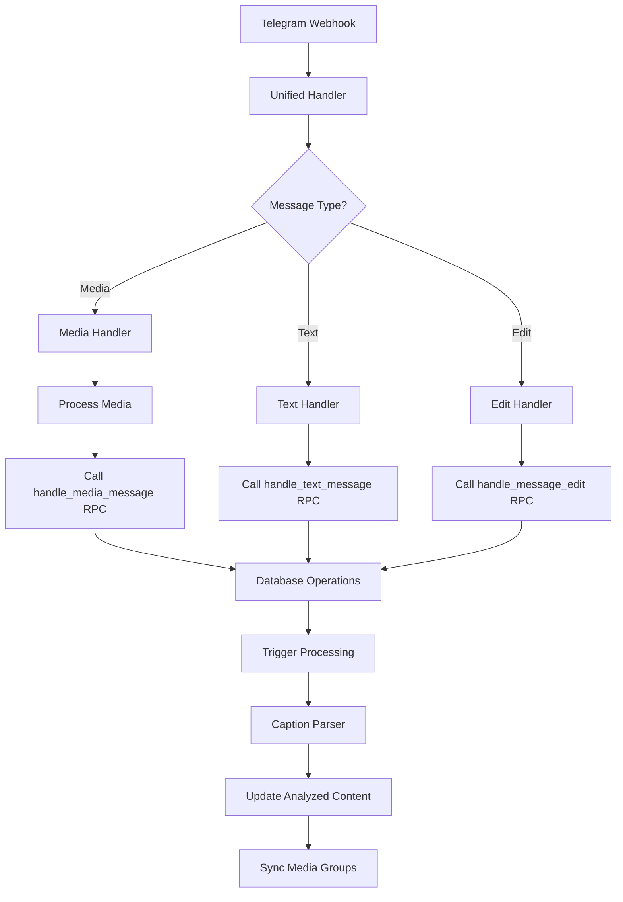
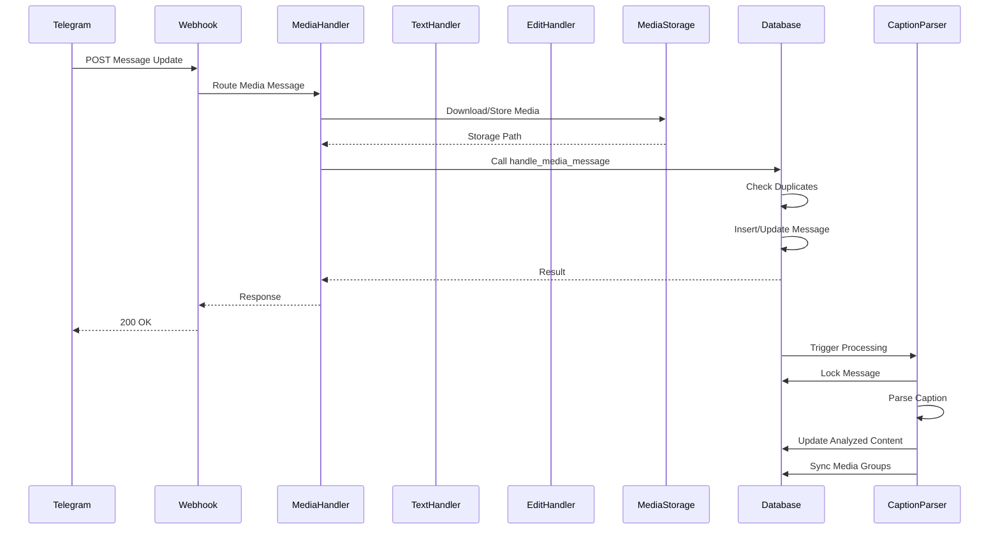
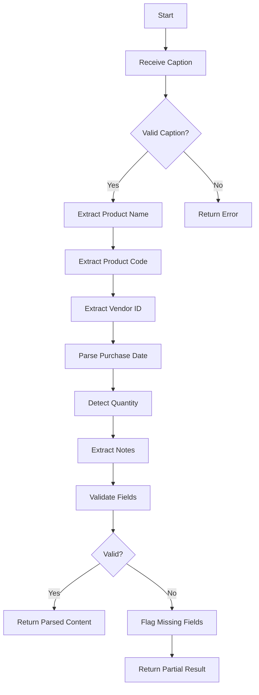
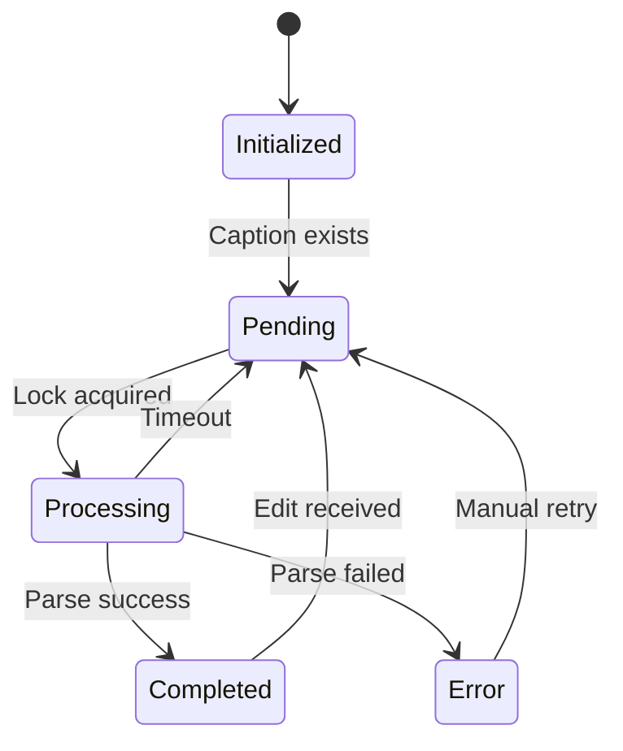
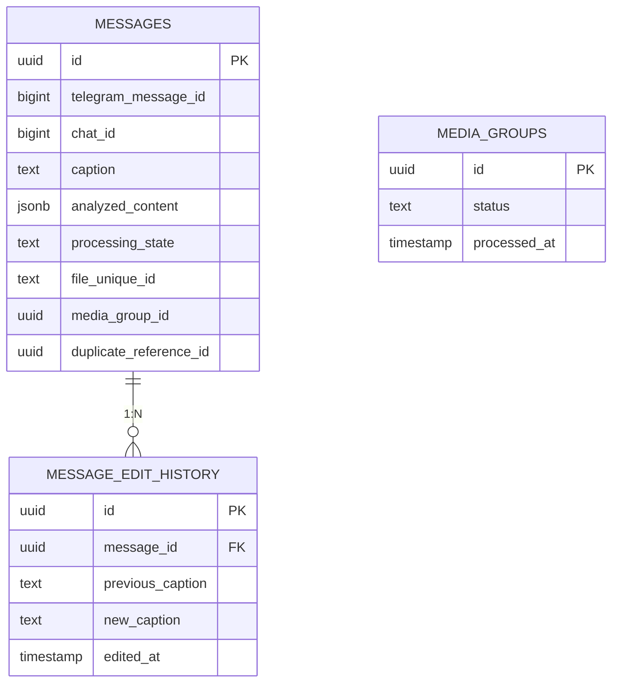
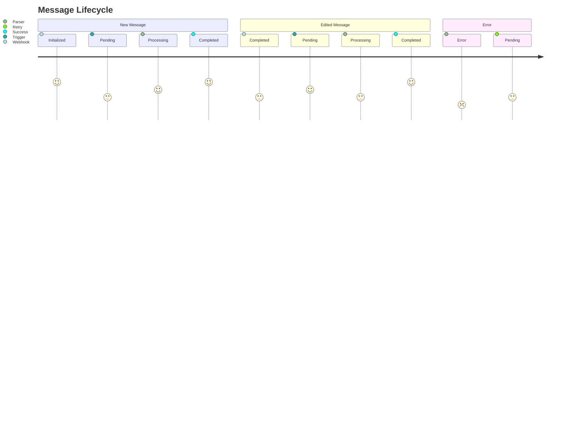

# Telegram Webhook Processing Flow

## Comprehensive System Overview



## Detailed Message Processing Flow



## Caption Parsing Flowchart



## Error Handling Flow



## Database Schema Relationships



## Key Components

### Edge Functions
- `telegram-webhook`: Main entry point with routing logic
- `parse-caption`: Processes captions in background
- `media-management`: Handles file operations

### Shared Utilities
- `captionParser.ts`: Advanced parsing with:
  ```typescript
  interface ParsedContent {
    product_name: string
    product_code: string
    vendor_uid: string | null
    purchase_date: string | null
    quantity: number | null
    notes: string
    parsing_metadata: {
      method: 'manual' | 'ai'
      timestamp: string
      missing_fields?: string[]
    }
  }
  ```
- `mediaStorage.ts`: Secure file handling
- `auditLogger.ts`: Centralized logging

### Database Functions
| Function | Purpose |
|----------|---------|
| `handle_media_message` | Core media processing |
| `handle_message_edit` | Edit handling |
| `xdelo_sync_media_group_content` | Group synchronization |

## Processing States



## Retry Mechanism

```mermaid
gantt
    title Retry Timeline
    dateFormat  HH:mm
    section Message
    Initial Attempt :a1, 09:00, 5m
    First Retry :a2, after a1, 5m
    Second Retry :a3, after a2, 5m
    Final Attempt :a4, after a3, 5m
    section System
    Backoff : 09:00, 15m
