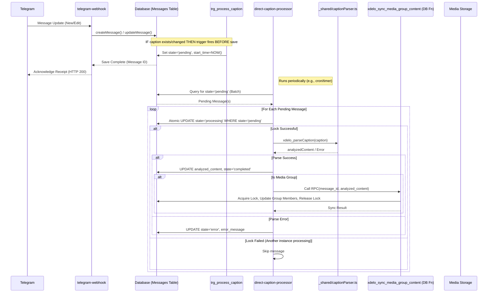

# Telegram Webhook Processing Flow

This document outlines the architecture, data flow, and components of the Telegram webhook system.

## Overview

The Telegram webhook system processes incoming messages from Telegram and stores them in the database. It handles:

1. Media messages (photos, videos, documents)
2. Text messages
3. Caption parsing and analysis
4. Media group synchronization
5. Forwarded messages
6. Edited messages

## Architecture Components (Hybrid Plan)

### Edge Functions

| Function | Purpose | Status | Notes |
|----------|---------|--------|-------|
| `telegram-webhook` | Main entry point for Telegram updates. Routes messages to handlers. | Active | - |
| `direct-caption-processor` | **Core processing engine.** Polls for 'pending' messages, parses captions, updates DB, triggers sync. | Active (Rewritten) | Replaces DB orchestration. Uses `_shared/captionParser.ts`. |
| `media-management` | Handles media file operations (download/upload). | Active | Likely called by `telegram-webhook`. |
| `xdelo_unified_media_repair` | Repairs missing or corrupted media. | Active | Separate utility/process. |
| `parse-caption` | *Obsolete?* Original function called by DB workflow. | Needs Removal? | Logic moved to `direct-caption-processor` using shared parser. |
| `manual-caption-parser` | *Obsolete?* Fallback parser. | Needs Removal? | Logic likely consolidated in `_shared/captionParser.ts`. |

### Shared Code

| Module | Purpose | Location |
|--------|---------|----------|
| `captionParser.ts` | Contains `xdelo_parseCaption` function for parsing logic. | `_shared/` |
| `dbOperations.ts` | DB interaction helpers for `telegram-webhook`. | `telegram-webhook/` |
| `consolidatedMessageUtils.ts` | Shared utilities (logging, metadata, etc.). | `_shared/` |
| `mediaStorage.ts` | Media download/upload logic. | `_shared/` |
| ... | Other shared utilities (`mediaUtils`, `messageUtils`, `supabase`, `cors`, `dbRetryUtils`) | `_shared/` |


### Database Functions

| Function | Purpose | Status | Notes |
|----------|---------|--------|-------|
| `xdelo_set_caption_pending_trigger` | Sets `processing_state` to 'pending' for messages with captions. | Active (New) | Called by `trg_process_caption`. |
| `xdelo_sync_media_group_content` | Synchronizes `analyzed_content` across media group members. Uses advisory locks. | Active | Called by `direct-caption-processor`. |
| `xdelo_recheck_media_groups` | Safety net: Periodically finds & fixes inconsistent media groups. | Active | Called by `pg_cron`. |
| `xdelo_sync_incomplete_media_group` | Helper for `xdelo_recheck_media_groups`. | Active | Called by `xdelo_recheck_media_groups`. |
| `xdelo_reset_stalled_messages` | Safety net: Periodically resets messages stuck in 'processing'. | Active | Called by `pg_cron`. |
| `xdelo_standardize_storage_paths` | Ensures consistent file paths. | Active | Utility function. |
| `set_public_url` | Generates public URLs for stored media. | Active | Called by `set_public_url` trigger. |
| `xdelo_validate_media_group_sync` | Validation logic run before `analyzed_content` update. | Active | Called by `trg_validate_media_group_sync`. Review needed if still optimal. |
| `xdelo_extract_analyzed_content` | Extracts fields from JSONB to columns. | Active | Called by `xdelo_trg_extract_analyzed_content`. Review needed if still optimal. |
| `xdelo_process_caption_workflow` | *Obsolete Orchestrator* | **Removed** | Replaced by `direct-caption-processor`. |
| `xdelo_check_media_group_content` | *Obsolete Check* | **Removed** | Logic moved to edge function / safety nets. |
| `check_media_group_on_message_change` | *Obsolete Check* | **Removed** | Logic moved to edge function / safety nets. |
| `xdelo_process_caption_trigger` | *Obsolete Trigger Function* | **Removed** | Replaced by `xdelo_set_caption_pending_trigger`. |


### Database Triggers

| Trigger | Function | Event | Purpose | Status | Notes |
|---------|----------|-------|---------|--------|-------|
| `trg_process_caption` | `xdelo_set_caption_pending_trigger` | BEFORE INSERT/UPDATE OF caption | Sets state to 'pending' if caption exists. | Active (Modified) | Core part of new flow. |
| `set_public_url` | `set_public_url` | BEFORE INSERT/UPDATE | Generates public URLs. | Active | Unchanged. |
| `trg_validate_media_group_sync` | `xdelo_validate_media_group_sync` | BEFORE INSERT/UPDATE OF analyzed_content | Validation before sync/update. | Active | Review recommended. |
| `xdelo_trg_extract_analyzed_content` | `xdelo_extract_analyzed_content` | BEFORE INSERT/UPDATE OF analyzed_content | Extracts fields to columns. | Active | Review recommended. |
| `trg_check_media_group_on_message_change` | `check_media_group_on_message_change` | AFTER INSERT/UPDATE | *Obsolete media group check.* | **Removed** | Conflicts with new flow. |
| ... | ... | ... | Other triggers (audit, SKU, PO, etc.) | Active | Assumed unchanged unless specified. |

## Data Flow (Hybrid Plan)

### Overall Message Flow



### Safety Net Flows

```mermaid
graph TD
    subgraph Stalled Message Reset
        CRON1[pg_cron Schedule] --> RF1[xdelo_reset_stalled_messages()]
        RF1 --> DB1[Query messages WHERE state='processing' AND started_at < timeout]
        DB1 --> RF1
        RF1 --> DB2[UPDATE state='pending']
    end

    subgraph Inconsistent Group Check
        CRON2[pg_cron Schedule] --> RF2[xdelo_recheck_media_groups()]
        RF2 --> DB3[Find groups with mixed states]
        DB3 --> RF2
        RF2 --> RF3[xdelo_sync_incomplete_media_group(group_id)]
        RF3 --> DB4[Find source message in group]
        DB4 --> RF3
        RF3 --> DB5[UPDATE incomplete messages in group]
    end
```

## Core Processing Logic (Hybrid Plan)

1.  **Webhook Ingestion (`telegram-webhook`):** Receives update, stores raw message data in `messages` table via `createMessage`, setting initial state (e.g., 'initialized'). Returns HTTP 200 to Telegram.
2.  **Trigger (`trg_process_caption`):** If the inserted/updated message has a non-empty `caption`, the `BEFORE` trigger fires, calling `xdelo_set_caption_pending_trigger` to update the `processing_state` to `'pending'` and set `processing_started_at` *before* the record is saved.
3.  **Polling (`direct-caption-processor`):** This Edge Function runs periodically (e.g., via Supabase cron trigger). It queries the `messages` table for a batch of records where `processing_state = 'pending'`.
4.  **Processing (`direct-caption-processor`):**
    *   For each pending message, it attempts an atomic update to set `processing_state = 'processing'` (acting as a lock).
    *   If successful, it retrieves the caption and calls the shared `xdelo_parseCaption` function (`_shared/captionParser.ts`).
    *   Based on the parsing result, it updates the message record:
        *   **Success:** Sets `analyzed_content`, `processing_state = 'completed'`, `processing_completed_at`.
        *   **Failure:** Sets `processing_state = 'error'`, `error_message`, `last_error_at`.
    *   Logs the outcome to `unified_audit_logs`.
5.  **Media Group Sync (`direct-caption-processor` -> `xdelo_sync_media_group_content`):**
    *   If caption processing succeeded *and* the message has a `media_group_id`, the `direct-caption-processor` calls the `xdelo_sync_media_group_content` database function via RPC.
    *   This function handles syncing the `analyzed_content` to other messages in the group using advisory locks.
6.  **Safety Nets (`pg_cron`):**
    *   `xdelo_reset_stalled_messages`: Periodically resets messages stuck in 'processing' back to 'pending'.
    *   `xdelo_recheck_media_groups`: Periodically finds and fixes media groups with inconsistent `analyzed_content`.

## Message Processing States (Hybrid Plan)

- `initialized`: Initial state after message is stored by webhook.
- `pending`: Caption exists, ready for processing by `direct-caption-processor`. Set by `trg_process_caption`.
- `processing`: Actively being processed by an instance of `direct-caption-processor`. Set by `direct-caption-processor`.
- `completed`: Processing and parsing successful. `analyzed_content` is populated. Set by `direct-caption-processor` or `xdelo_sync_media_group_content`.
- `error`: Processing failed. `error_message` field contains details. Set by `direct-caption-processor`.

## Key Changes from Previous Flow

*   Removed the complex `xdelo_process_caption_workflow` database function and its reliance on `pg_net`.
*   Simplified the database trigger (`trg_process_caption`) to only set the 'pending' state.
*   Centralized the core processing orchestration (polling, parsing, state updates, sync triggering) within the `direct-caption-processor` Edge Function.
*   Removed the conflicting `trg_check_media_group_on_message_change` trigger.
*   Relies on `pg_cron` jobs for safety nets (stalled messages, group consistency) instead of complex trigger logic.
