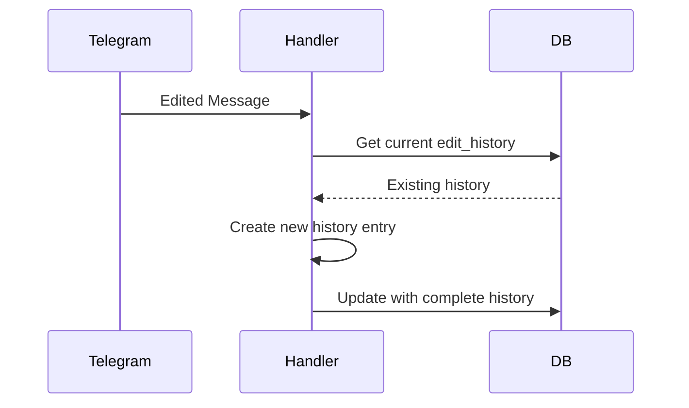
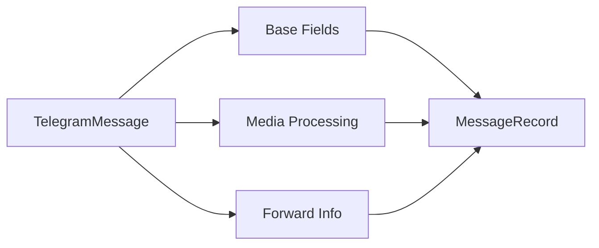
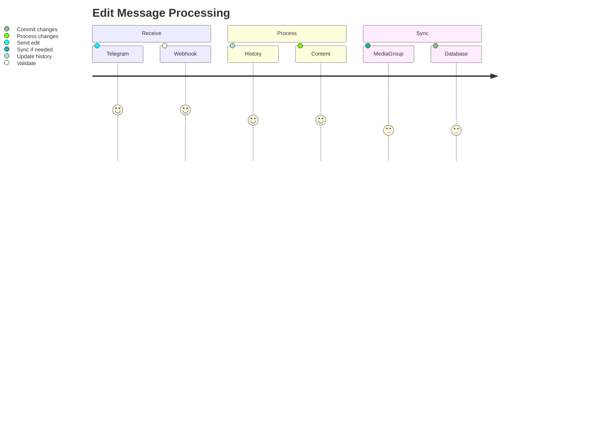

# Telegram Webhook Processing Flow

## Overview
[Previous content remains unchanged...]

## New: Edit History System



### Key Properties:
- Tracks all message edits (text, caption, media)
- Preserves previous states
- Includes timestamps and edit sources
- Used for auditing and recovery

### Edit History Item Structure:
```typescript
interface EditHistoryItem {
  timestamp: string; // ISO date
  previous_text?: string;
  previous_caption?: string;
  new_text?: string;
  new_caption?: string; 
  edit_source: 'telegram' | 'manual' | 'system';
  edit_date: string; // ISO date
}
```

## Enhanced: Media Group Synchronization

### Updated Sync Parameters:
```typescript
interface SyncOptions {
  forceSync: boolean; // Sync even single messages
  syncEditHistory: boolean; // Propagate edit history
}

// Example usage:
await syncMediaGroupContent(
  messageId,
  { 
    media_group_id: groupId,
    caption: message.caption 
  },
  { 
    forceSync: true,
    syncEditHistory: false 
  }
);
```

## New: Interface Transformations

### TelegramMessage → MessageRecord


### Transformation Process:
1. Extract core message fields
2. Process media attachments (if any)
3. Handle forwarded message metadata
4. Build complete database record

## Updated: Data Flow Diagrams

### Edit Processing Flow


[Previous sections about architecture, error handling etc. remain unchanged...]
