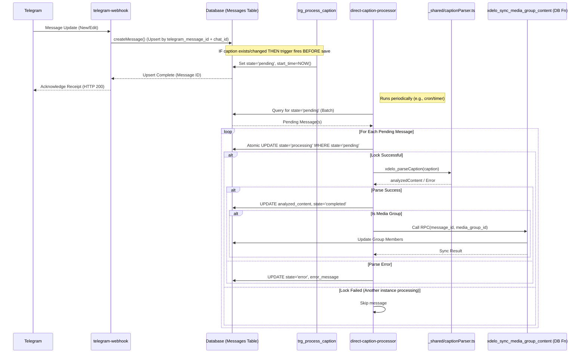

# Telegram Webhook Processing Flow

This document outlines the architecture, data flow, and components of the Telegram webhook system.

## Overview

The Telegram webhook system processes incoming messages from Telegram and stores them in the database. It handles:

1. Media messages (photos, videos, documents)
2. Text messages
3. Caption parsing and analysis
4. Media group synchronization
5. Forwarded messages
6. Edited messages

## Architecture Components (Hybrid Plan)

### Edge Functions

| Function                     | Purpose                                                                                               | Status | Notes                            |
| ---------------------------- | ----------------------------------------------------------------------------------------------------- | ------ | -------------------------------- |
| `telegram-webhook`           | Main entry point for Telegram updates. Routes messages to handlers.                                   | Active | -                                |
| `parse-caption`             | **Core processing engine.** Polls for 'pending' messages, parses captions, updates DB, triggers sync. | Active | Uses enhanced parsing logic from `parse-caption` function. |
| `media-management`           | Handles media file operations (download/upload).                                                      | Active | Called by `telegram-webhook`.    |
| `xdelo_unified_media_repair` | Repairs missing or corrupted media.                                                                   | Active | Separate utility/process.        |

### Shared Code

| Module                        | Purpose                                                   | Location            |
| ----------------------------- | --------------------------------------------------------- | ------------------- |
| `captionParser.ts`            | Contains enhanced `xdelo_parseCaption` function with detailed logging and error handling. | `_shared/`          |
| `consolidatedMessageUtils.ts` | Shared utilities for metadata extraction, logging, etc.   | `_shared/`          |
| `dbOperations.ts`             | DB interaction helpers for `telegram-webhook`. Implements upsert pattern for message handling. | `telegram-webhook/` |
| `mediaStorage.ts`             | Media download/upload logic.                              | `_shared/`          |

### Database Functions

| Function                            | Purpose                                                           | Status | Notes                                   |
| ----------------------------------- | ----------------------------------------------------------------- | ------ | --------------------------------------- |
| `xdelo_extract_telegram_metadata`   | Extracts essential data from telegram_data JSON.                  | Active | Called by DB triggers.                  |
| `xdelo_set_caption_pending_trigger` | Sets `processing_state` to 'pending' for messages with captions.  | Active | Called by `trg_process_caption`.        |
| `xdelo_sync_media_group_content`    | Synchronizes `analyzed_content` across media group members.       | Active | Called by `direct-caption-processor`.   |
| `xdelo_recheck_media_groups`        | Safety net: Periodically finds & fixes inconsistent media groups. | Active | Called by `pg_cron`.                    |
| `xdelo_sync_incomplete_media_group` | Helper for `xdelo_recheck_media_groups`.                          | Active | Called by `xdelo_recheck_media_groups`. |
| `xdelo_reset_stalled_messages`      | Safety net: Periodically resets messages stuck in 'processing'.   | Active | Called by `pg_cron`.                    |
| `set_public_url`                    | Generates public URLs for stored media.                           | Active | Called by `set_public_url` trigger.     |

### Database Triggers

| Trigger                           | Function                            | Event                           | Purpose                                    | Status | Notes                   |
| --------------------------------- | ----------------------------------- | ------------------------------- | ------------------------------------------ | ------ | ----------------------- |
| `trg_process_caption`             | `xdelo_set_caption_pending_trigger` | BEFORE INSERT/UPDATE OF caption | Sets state to 'pending' if caption exists. | Active | Core part of new flow.  |
| `set_public_url`                  | `set_public_url`                    | BEFORE INSERT/UPDATE            | Generates public URLs.                     | Active | Unchanged.              |
| `trg_handle_telegram_data_insert` | `handle_telegram_data_insert`       | BEFORE INSERT                   | Sets telegram_metadata                     | Active | Extracts metadata.      |
| `trg_handle_telegram_data_update` | `handle_telegram_data_update`       | BEFORE UPDATE                   | Updates telegram_metadata                  | Active | Keeps metadata in sync. |

## Data Flow (Hybrid Plan)

### Overall Message Flow



### Safety Net Flows

```mermaid
graph TD
    subgraph Stalled Message Reset
        CRON1[pg_cron Schedule] --> RF1[xdelo_reset_stalled_messages()]
        RF1 --> DB1[Query messages WHERE state='processing' AND started_at < timeout]
        DB1 --> RF1
        RF1 --> DB2[UPDATE state='pending']
    end

    subgraph Inconsistent Group Check
        CRON2[pg_cron Schedule] --> RF2[xdelo_recheck_media_groups()]
        RF2 --> DB3[Find groups with mixed states]
        DB3 --> RF2
        RF2 --> RF3[xdelo_sync_incomplete_media_group(group_id)]
        RF3 --> DB4[Find source message in group]
        DB4 --> RF3
        RF3 --> DB5[UPDATE incomplete messages in group]
    end
```

## Message Processing States (Hybrid Plan)

- `initialized`: Initial state after message is stored by webhook.
- `pending`: Caption exists, ready for processing by `direct-caption-processor`. Set by `trg_process_caption`.
- `processing`: Actively being processed by an instance of `direct-caption-processor`. Set by `direct-caption-processor`.
- `completed`: Processing and parsing successful. `analyzed_content` is populated. Set by `direct-caption-processor` or `xdelo_sync_media_group_content`.
- `error`: Processing failed. `error_message` field contains details. Set by `direct-caption-processor`.

## Metadata Extraction

- All incoming messages have their `telegram_metadata` extracted from the full `telegram_data` JSON.
- This extraction happens automatically via the `trg_handle_telegram_data_insert` and `trg_handle_telegram_data_update` triggers.
- The metadata extraction function `xdelo_extract_telegram_metadata` keeps only essential fields, reducing storage requirements.
- Having this metadata extracted makes queries faster and reduces load on the database.

## Error Recovery

The system has multiple layers of error recovery:

1. **Worker Pattern**: The direct-caption-processor uses atomic updates to lock messages, preventing duplicate processing.
2. **Stalled Message Detection**: A pg_cron job periodically resets messages stuck in 'processing' for too long.
3. **Media Group Consistency**: A separate pg_cron job finds and fixes inconsistencies in media groups.
4. **System Repair Tools**: UI tools are available for administrators to manually reset stuck messages or recheck media groups.
