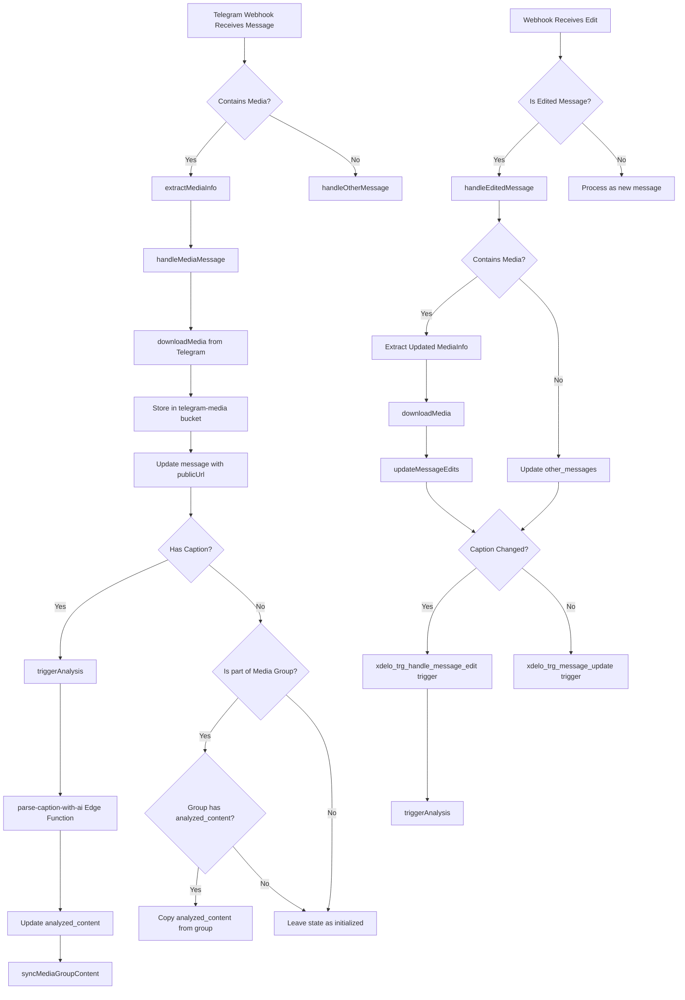

# Telegram Webhook Flow - Implementation Details

## Message Processing Flow Diagram

## Function Flow

### 1. Initial Reception - `handleWebhookUpdate` (messageHandlers.ts)
- **Entry Point**: Receives Telegram update from webhook
- **Processing**:
  - Generates correlation ID: `correlationId = webhook-${timestamp}-${random}`
  - Logs via getLogger
  - Routes to appropriate handler based on message type

### 2. Text Message Flow - `handleOtherMessage` (messageHandlers.ts)
- **Database Operations**:
  - `findExistingMessage` - Checks if message already exists
  - `createOtherMessage` or `updateOtherMessage` - Inserts/updates in other_messages table
- **Database Triggers**:
  - `xdelo_trg_set_timestamp` (INSERT)
  - `xdelo_trg_update_timestamp` (UPDATE)
- **State**: Sets processing_state as 'completed' immediately

### 3. Media Message Flow - `handleMediaMessage` (messageHandlers.ts)

#### A. New Media Processing:
- **Key Functions**:
  - `extractMediaInfo` - Gets media metadata
  - `downloadMedia` - Downloads and stores media in Supabase
- **Database Operations**:
  - `findExistingMessage` - Checks for existing media by file_unique_id
  - `createMessage` or `updateMessage` - Creates/updates messages table
- **Triggers**:
  - `xdelo_trg_set_timestamp` (INSERT)
- **State Setting**:
  - With caption: Sets processing_state to 'pending'
  - Without caption: Sets processing_state to 'initialized'
- **Analysis**:
  - With caption: Calls `triggerAnalysis`

#### B. Media Group Handling:
- **Group Detection**: Identifies messages with same media_group_id
- **Group Synchronization**: 
  - Checks for existing analyzed content in the group
  - Uses `syncMediaGroupContent` to update all group messages
- **Database Triggers**:
  - `xdelo_trg_sync_media_group_content` - Syncs any analyzed content changes

### 4. Edit Flow - `handleEditedMessage` (messageHandlers.ts)
- **Detection**: Identifies edits via edited_message or edited_channel_post
- **Database Operations**:
  - `updateMessageEdits` - Updates message with edit information
- **Triggers**:
  - `xdelo_trg_handle_message_edit` - For caption changes
  - `xdelo_trg_message_update` - For general updates
- **Re-analysis**:
  - If caption changed: Calls `triggerAnalysis`

### 5. Analysis Flow - `triggerAnalysis` (dbOperations.ts)
- **Process**:
  - Updates state to 'processing'
  - Invokes parse-caption-with-ai edge function
  - Edge function updates analyzed_content
- **Database Triggers**:
  - `xdelo_trg_sync_media_group_content` - Syncs analysis to media group

### 6. Caption Analysis - `parse-caption-with-ai` (Edge Function)
- **Parsing Process**:
  - Manual parsing first (extracting product name, code, etc.)
  - AI enhancement if product_name > 23 characters
  - Updates message with analyzed_content
  - For media groups: Syncs analysis to all group messages

## Core Functions & Their Roles

### In messageHandlers.ts:
- `handleWebhookUpdate`: Main entry point for all webhook updates
- `extractMediaInfo`: Extracts media details from messages
- `handleMediaMessage`: Processes messages with media
- `handleOtherMessage`: Processes text messages and commands
- `handleEditedMessage`: Handles message edits
- `determineMessageType`: Identifies message type (text, command, etc.)

### In dbOperations.ts:
- `findExistingMessage`: Queries for existing messages
- `createMessage`/`updateMessage`: Creates/updates media messages
- `createOtherMessage`/`updateOtherMessage`: Creates/updates text messages
- `createStateLog`: Logs state changes
- `syncMediaGroupContent`: Synchronizes content across media groups
- `triggerAnalysis`: Initiates caption analysis
- `updateMessageEdits`: Updates edit history

### In mediaUtils.ts:
- `downloadMedia`: Downloads and stores media from Telegram
- `extractMediaInfo`: Extracts media metadata

## Database Triggers

- `xdelo_trg_set_timestamp`: Sets created_at on INSERT
- `xdelo_trg_update_timestamp`: Updates updated_at on UPDATE
- `xdelo_trg_handle_message_edit`: Processes caption changes
- `xdelo_trg_message_update`: Handles general message updates
- `xdelo_trg_sync_media_group_content`: Synchronizes media group content
- `xdelo_trg_message_deletion`: Handles message deletions

## Edge Functions

- `telegram-webhook`: Main webhook handler
- `parse-caption-with-ai`: Caption parsing and analysis