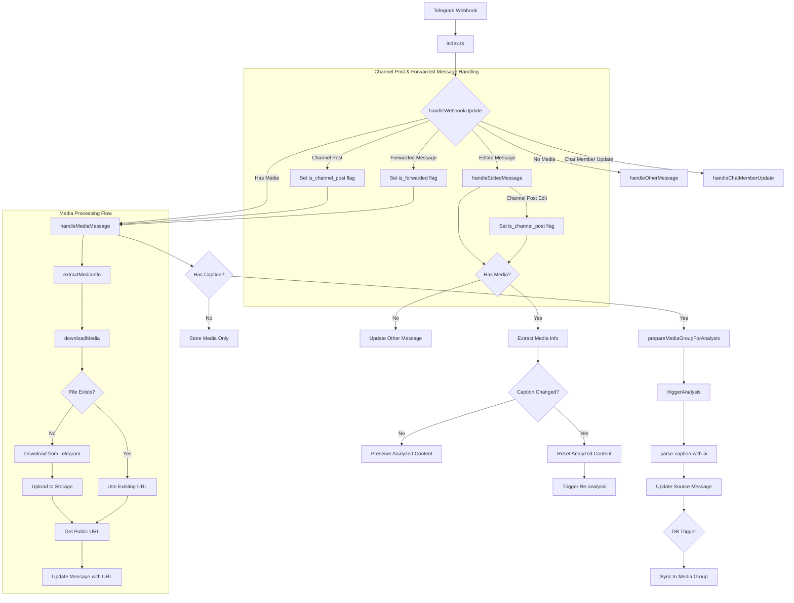

# Telegram Webhook Flow

## Overview

This document describes the flow of data through the Telegram webhook system, focusing on how messages with media are processed, especially for forwarded channel posts and edited messages.

## Message Processing Flow

### 1. Entry Point (index.ts)

- Receives webhook requests
- Parses JSON payload
- Delegates processing to the messageHandlers.ts component
- Returns formatted responses

### 2. Message Processing (messageHandlers.ts)

- **handleWebhookUpdate**: Main function that determines message type and routes to appropriate handlers
  - Identifies message types (channel post, edited message, forwarded message)
  - Passes appropriate flags to handlers
- **handleMediaMessage**: Processes photo/video messages with proper type flags
- **handleOtherMessage**: Processes text, commands, and other non-media messages
- **handleEditedMessage**: Handles message edits with proper history tracking
- **handleChatMemberUpdate**: Processes chat member status changes

### 3. Media-First Approach

- Any message with a `file_unique_id` is treated as a media message first
- Media is always downloaded and stored, regardless of message type
- Message type flags (channel post, edited, forwarded) are preserved for specialized processing

### 4. Media Handling (mediaUtils.ts)

- Media extraction from messages
- Downloading from Telegram
- Uploading to Supabase storage with proper file replacement
- URL generation

### 5. Database Operations (dbOperations.ts)

- Functions for creating, updating, and querying messages
- Edit history management
- Media group synchronization
- State logging

### 6. Media Group Processing

- When a message with caption is part of a media group:
  - `prepareMediaGroupForAnalysis` updates metadata (but doesn't sync captions)
  - It triggers analysis via `triggerAnalysis`
  - `parse-caption-with-ai` analyzes the caption and updates the source message
  - The database trigger `xdelo_sync_media_group_analyzed_content` detects the analyzed content and syncs it to all messages in the group
- For messages without captions in a media group:
  - The system checks if any message in the group already has analyzed content
  - If found, it uses that content for the current message

### 7. Edited Message Handling

- For edited messages with media:
  - The system identifies if it's a channel post or regular message
  - Edit history is properly tracked
  - If caption has changed, analyzed content is reset
  - For media groups, all messages in the group have their analyzed content reset
  - Analysis is triggered for the new caption

### 8. Forwarded Message Handling

- Forwarded messages are properly identified
- Source channel information is preserved
- Media is downloaded and stored using the same `file_unique_id` approach
- Caption analysis follows the standard flow

## Database Triggers

The system uses database triggers to maintain consistency:

```sql
CREATE OR REPLACE FUNCTION xdelo_handle_all_message_updates()
RETURNS TRIGGER AS $$
BEGIN
    -- For any message with a caption change, reset processing state and analyzed content
    IF NEW.caption IS DISTINCT FROM OLD.caption THEN
        NEW.processing_state = 'pending';
        NEW.analyzed_content = NULL;
        NEW.parsed_product_code = NULL;
        NEW.parsed_vendor_uid = NULL;
        NEW.parsed_purchase_date = NULL;
        NEW.parsed_quantity = NULL;
        NEW.parsed_unit_price = NULL;
        NEW.parsed_total_price = NULL;
        NEW.parsed_notes = NULL;
        NEW.parsed_caption = NULL;
    END IF;
    
    -- For edited messages, ensure proper edit tracking
    IF NEW.is_edited AND NOT OLD.is_edited THEN
        -- Add edit tracking logic here if needed
    END IF;
    
    RETURN NEW;
END;
$$ LANGUAGE plpgsql;

-- Create a single trigger for all message updates
DROP TRIGGER IF EXISTS xdelo_trg_handle_message_edit ON messages;
DROP TRIGGER IF EXISTS xdelo_trg_message_update ON messages;

CREATE TRIGGER xdelo_trg_handle_all_message_updates
BEFORE UPDATE ON messages
FOR EACH ROW
EXECUTE FUNCTION xdelo_handle_all_message_updates();
```

This trigger ensures that:
- When a caption changes, all analyzed content is reset
- Proper edit tracking is maintained

Additionally, the `xdelo_sync_media_group_analyzed_content` trigger handles syncing analyzed content across media groups:

```sql
CREATE OR REPLACE FUNCTION xdelo_sync_media_group_analyzed_content()
RETURNS TRIGGER AS $$
BEGIN
    -- Only proceed if we have analyzed_content and a media_group_id
    IF NEW.analyzed_content IS NOT NULL AND NEW.media_group_id IS NOT NULL THEN
        -- Update all other messages in the same media group
        UPDATE messages
        SET 
            analyzed_content = NEW.analyzed_content,
            processing_state = 'completed',
            group_caption_synced = true,
            message_caption_id = NEW.id,
            updated_at = NOW()
        WHERE 
            media_group_id = NEW.media_group_id 
            AND id != NEW.id;

        -- Log the sync operation
        PERFORM xdelo_log_event(
            'media_group_synced'::audit_event_type,
            NEW.id,
            NEW.telegram_message_id,
            NEW.chat_id,
            NULL,
            jsonb_build_object(
                'media_group_id', NEW.media_group_id,
                'analyzed_content', NEW.analyzed_content
            ),
            jsonb_build_object(
                'sync_source', 'analyzed_content_trigger',
                'affected_messages', (
                    SELECT json_agg(id) 
                    FROM messages 
                    WHERE media_group_id = NEW.media_group_id 
                    AND id != NEW.id
                )
            ),
            NEW.correlation_id
        );
    END IF;
    
    RETURN NEW;
END;
$$ LANGUAGE plpgsql;

CREATE TRIGGER xdelo_trg_sync_media_group_analyzed_content
AFTER UPDATE OF analyzed_content ON messages
FOR EACH ROW
WHEN (NEW.analyzed_content IS NOT NULL AND NEW.media_group_id IS NOT NULL)
EXECUTE FUNCTION xdelo_sync_media_group_analyzed_content();
```

## Audit Logging System

The application uses multiple mechanisms for audit logging:

### 1. Database Functions

Three database functions handle different aspects of logging:

- **xdelo_log_event**: Inserts records into unified_audit_logs
- **xdelo_get_logger**: Creates a JSON structure for logging
- **xdelo_log_webhook_event**: Inserts records into webhook_logs

### 2. Direct Table Inserts

The code also directly inserts records into logging tables:

- **unified_audit_logs**: In log-operation/index.ts
- **webhook_logs**: In telegram-webhook/messageHandlers.ts

### 3. RPC Calls

The code calls the xdelo_log_event function via RPC from various handlers.

### 4. Audit Event Types

The audit_event_type enum is used in the unified_audit_logs table with these values:

- message_created
- message_updated
- message_deleted
- message_analyzed
- webhook_received
- media_group_synced
- message_edited

## Recent Changes

### 1. Fixed Media Group Syncing Flow

The key issue was that media group syncing was happening prematurely, before caption analysis was complete. This has been fixed by:

- Renamed and Modified syncMediaGroupContent:
  - Changed to prepareMediaGroupForAnalysis in dbOperations.ts
  - Removed premature syncing of raw captions
  - Kept metadata updates and analysis triggering
- Updated Message Handlers:
  - Added proper imports for the renamed functions
  - Updated the media group handling logic to use the new approach
- Fixed parse-caption-with-ai/index.ts:
  - Removed the direct call to syncMediaGroup
  - Now just updates the source message with analyzed content
  - Lets the database trigger handle syncing to other messages in the group

### 2. Enhanced Message Type Handling

- Added proper detection of message types (channel post, edited message, forwarded message)
- Updated handlers to use these flags for specialized processing
- Improved edit history tracking for all message types

### 3. Improved Media Handling

- Modified the downloadMedia function to always download and store media
- Implemented proper file replacement for updated media
- Added better error handling and recovery for media downloads

### 4. Enhanced Edited Message Processing

- Updated handleEditedMessage to properly identify channel posts vs regular messages
- Added proper edit history tracking for all message types
- Implemented caption change detection to trigger re-analysis when needed

### 5. Consolidated Database Triggers

- Created a single trigger (xdelo_trg_handle_all_message_updates) to handle all message updates
- Simplified the logic for caption changes and edit tracking

## SQL Triggers to Run

To implement the fixes, run the following SQL triggers:

```sql
-- Consolidated trigger for handling all message updates
CREATE OR REPLACE FUNCTION xdelo_handle_all_message_updates()
RETURNS TRIGGER AS $$
BEGIN
    -- For any message with a caption change, reset processing state and analyzed content
    IF NEW.caption IS DISTINCT FROM OLD.caption THEN
        NEW.processing_state = 'pending';
        NEW.analyzed_content = NULL;
        NEW.parsed_product_code = NULL;
        NEW.parsed_vendor_uid = NULL;
        NEW.parsed_purchase_date = NULL;
        NEW.parsed_quantity = NULL;
        NEW.parsed_unit_price = NULL;
        NEW.parsed_total_price = NULL;
        NEW.parsed_notes = NULL;
        NEW.parsed_caption = NULL;
    END IF;
    
    -- For edited messages, ensure proper edit tracking
    IF NEW.is_edited AND NOT OLD.is_edited THEN
        -- Add edit tracking logic here if needed
    END IF;
    
    RETURN NEW;
END;
$$ LANGUAGE plpgsql;

-- Create a single trigger for all message updates
DROP TRIGGER IF EXISTS xdelo_trg_handle_message_edit ON messages;
DROP TRIGGER IF EXISTS xdelo_trg_message_update ON messages;

CREATE TRIGGER xdelo_trg_handle_all_message_updates
BEFORE UPDATE ON messages
FOR EACH ROW
EXECUTE FUNCTION xdelo_handle_all_message_updates();
```

This trigger ensures that when a caption changes, all analyzed content is reset, and proper edit tracking is maintained.
