# Telegram Bot Message Processing Flow

## 1. Core Processing Architecture


## 2. Message Reception & Processing

### Update Type Detection
```typescript
// Actual implementation
const message = update.message || 
               update.channel_post || 
               update.edited_message ||
               update.edited_channel_post;

if (!message) {
  if (update.my_chat_member || update.chat_member) {
    return await handleChatMemberUpdate(supabase, memberUpdate, correlationId);
  }
}
```

### Message Type Classification
```typescript
function determineMessageType(message: TelegramMessage): TelegramOtherMessageType {
  if (message.text?.startsWith('/')) return 'command';
  if (message.text) return 'text';
  if (message.sticker) return 'sticker';
  if (message.voice) return 'voice';
  if (message.document) return 'document';
  if (message.location) return 'location';
  if (message.contact) return 'contact';
  return 'text';
}
```

## 3. Media Message Flow

### Media Processing States

```mermaid
stateDiagram-v2
    [*] --> initialized: New Media
    initialized --> pending: Has Caption
    pending --> processing: Analysis Start
    processing --> completed: Analysis Success
    processing --> error: Analysis Failure
    error --> pending: Retry < 3
    error --> failed: Retry ≥ 3
```


### Media Group Handling


## 4. Non-Media Message Flow

### Message Types and Processing


### State Management
- Simpler than media messages
- Usually marked as 'completed' immediately
- No complex processing or retries
- Command processing happens synchronously

## 5. Channel Post Handling

### Channel Media Posts


### Channel Post States
- Identical to regular message states
- Additional flag: is_channel_post
- Special handling for edited channel posts

## 6. Edit Handling

### Edit Types


### Edit Processing
- Track edit history
- Handle caption changes
- Update processing state if needed
- Maintain group synchronization

## 7. Database Structure

### Tables Overview
1. **messages**
   - Media content
   - Processing states
   - Group handling
   - Analysis results

2. **other_messages**
   - Non-media content
   - Command data
   - Member updates
   - Simple states

3. **message_state_logs**
   - State transitions
   - Timestamps
   - Previous states

4. **webhook_logs**
   - Event tracking
   - Error logging
   - Correlation IDs

## 8. Monitoring & Recovery

### Monitoring Views
```sql
CREATE MATERIALIZED VIEW message_flow_logs AS
SELECT 
  m.id,
  m.processing_state,
  m.created_at,
  wl.event_type,
  sl.previous_state,
  sl.new_state
FROM messages m
LEFT JOIN webhook_logs wl
LEFT JOIN message_state_logs sl;
```

### Error Recovery
```sql
-- Reset stuck messages
UPDATE messages SET
  processing_state = 'initialized',
  retry_count = COALESCE(retry_count, 0) + 1
WHERE 
  processing_state IN ('processing', 'pending')
  AND processing_started_at < NOW() - interval '15 minutes'
  AND retry_count < 3;
```

## 9. Integration Points

### External Services
1. **Telegram Bot API**
   - Message reception
   - File downloads
   - Command responses

2. **Storage Service**
   - Media storage
   - File management
   - URL generation

3. **AI Analysis**
   - Caption processing
   - Product extraction
   - Metadata analysis

### Database Functions
```sql
-- Key functions
CREATE OR REPLACE FUNCTION xdelo_update_message_processing_state();
CREATE OR REPLACE FUNCTION xdelo_sync_media_group_content();
CREATE OR REPLACE FUNCTION xdelo_handle_media_group_sync();
```

## 10. Security & Access Control

### RLS Policies
```sql
-- Messages table
CREATE POLICY "Enable full access for authenticated users" 
ON public.messages FOR ALL TO authenticated
USING (true) WITH CHECK (true);

-- Other messages table
CREATE POLICY "Enable full access for authenticated users" 
ON public.other_messages FOR ALL TO authenticated
USING (true) WITH CHECK (true);
```

### Function Security
```sql
-- All processing functions use SECURITY DEFINER
CREATE OR REPLACE FUNCTION process_message()
RETURNS void
LANGUAGE plpgsql
SECURITY DEFINER
AS $$
  -- Function body
$$;
``` 