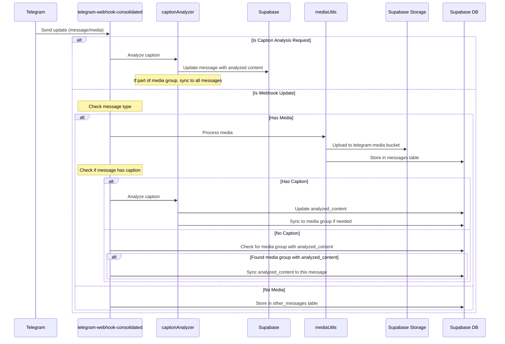

# Telegram Webhook Consolidated

This is a consolidated implementation of the Telegram webhook and caption analysis functionality. It combines the functionality of the `telegram-webhook` and `parse-caption-with-ai` functions into a single, more efficient implementation.

## Features

- Handles Telegram webhook updates (messages, edited messages, channel posts, etc.)
- Processes and stores media (photos, videos, documents)
- Analyzes captions to extract product information
- Handles media groups and syncs analyzed content across group messages
- Provides comprehensive logging and error handling

## Architecture



## File Structure

- `index.ts` - Main entry point that handles both webhook updates and caption analysis
- `types.ts` - Type definitions for Telegram messages, database records, etc.
- `config.toml` - Configuration for the Supabase Edge Function
- `utils/` - Utility functions
  - `corsUtils.ts` - CORS headers for HTTP responses
  - `logger.ts` - Logging utility with correlation IDs
  - `mediaUtils.ts` - Media processing utilities
  - `captionAnalyzer.ts` - Caption analysis logic
  - `quantityParser.ts` - Quantity extraction from captions
  - `messageHandlers.ts` - Message processing handlers

## Endpoints

The function exposes two main endpoints:

1. `/telegram-webhook-consolidated` - Handles Telegram webhook updates
2. `/telegram-webhook-consolidated/parse-caption` - Handles caption analysis requests

## Environment Variables

- `TELEGRAM_BOT_TOKEN` - Telegram Bot API token
- `OPENAI_API_KEY` - OpenAI API key for AI-powered caption analysis (optional)

## Improvements Over Previous Implementation

1. **Consolidated Functionality**: Combined two separate functions into one, reducing duplication and improving maintainability.
2. **Streamlined Media Processing**: More efficient media handling with better error recovery.
3. **Enhanced Caption Analysis**: Improved caption parsing with fallback mechanisms.
4. **Consistent Error Handling**: Standardized error handling and logging throughout the codebase.
5. **Better Media Group Handling**: More robust handling of media groups with synchronized caption analysis.
6. **Correlation IDs**: End-to-end tracing with correlation IDs for better debugging.

## Deployment

Deploy this function to Supabase Edge Functions:

```bash
supabase functions deploy telegram-webhook-consolidated
```

Then set up your Telegram bot webhook to point to:

```
https://[PROJECT_REF].supabase.co/functions/v1/telegram-webhook-consolidated
